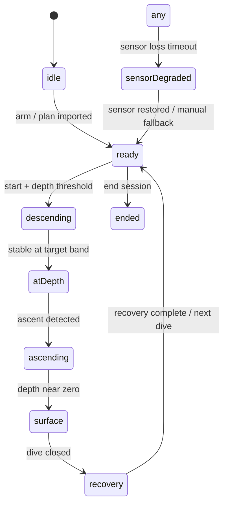

# Apnea architecture (Watch + iOS)

**Branch:** `integration/full-computer`  
**Status:** Integration experimental — **not certified** for freediving safety. See [`SAFETY_DISCLAIMER.md`](SAFETY_DISCLAIMER.md).

## Overview

Apnea mode adds breath-hold session tracking on Apple Watch with an iOS companion for planning, logbook, statistics, and Watch sync. It shares depth-ingest patterns with Gauge/Full Computer but uses a dedicated lifecycle engine and sync namespace.

| Layer | Location | Responsibility |
|-------|----------|----------------|
| Domain models | `Shared/Models/Apnea*.swift` | Session, dive, alarms, markers, profiles |
| Lifecycle engine | `Shared/Utils/ApneaSessionEngine.swift`, `ApneaLifecycleStateMachine.swift` | Idle → dive → ascent → surface recovery → summary |
| Depth feed | `Utils/DiveDepthMeasurementIngestion.swift` | Spike rejection, monotonic timestamps |
| Operational events | `Shared/Utils/ApneaOperationalEventEngine.swift` | Markers, targets, depth/time alarms |
| Recovery | `Shared/Utils/ApneaRecoveryComputation.swift` | 1:1, 2:1, fixed, informational policies |
| Watch presentation | `Utils/ApneaWatchPresentation.swift`, `Views/ApneaView.swift` | Stage mapping, start gate, overlays |
| Watch logbook | `Services/ApneaLogbookStore.swift` | Local persistence + outbound session sync |
| iOS companion | `iOSApp/Views/Apnea/`, `iOSApp/Services/IOSApnea*.swift` | Dashboard, planner, logbook, export |
| Plan sync (iOS → Watch) | `Shared/Utils/ApneaSyncCodec.swift`, `apneaSyncPlanPackage` | Signed plan package + ACK |
| Session sync (Watch → iOS) | `ApneaSessionSyncCodec.swift`, `dirdiving_apnea_session` | Idempotent logbook merge |

## State machine

Phases are encoded in `ApneaLifecyclePhase` and surfaced through `ApneaWatchPresentation` stages (`ready`, `dive`, `ascent`, `surfaceRecovery`, `sessionSummary`).

## Sync schema

| Channel | Key / type | Direction |
|---------|------------|-----------|
| Plan package | `apneaSyncPlanPackage` | iOS → Watch |
| Session transport | `dirdiving_apnea_session` | Watch → iOS |
| Dive sessions (Gauge/FC) | `dirdiving_dive_session` | Watch → iOS (unchanged) |
| FC plan package | `fullComputerPlanPackage` | iOS → Watch (unchanged) |

Namespaces are isolated by automated self-check (`ApneaReleaseSelfCheck`).

## Safety gates

- **Sensor degraded:** `ApneaWatchPresentation` disables session start when depth automation is stale/unavailable.
- **No silent reset:** checkpoint restore preserves session ID, dives, and tissue-agnostic apnea state; corrupt checkpoints are rejected.
- **Buddy disclaimer:** iOS buddy screen states the app does not provide remote rescue monitoring; Watch shows buddy reminder only (not a rescue link).
- **No unvalidated claims:** source scan forbids blackout / no-movement detection marketing strings.
- **Degraded analytics:** `ApneaRecordEligibilityPolicy` excludes simulated and data-quality-degraded sessions from personal records by default.
- **Feature flag:** `ExperimentalFeatures.apneaIntegrationEnabled` gates integration builds (see `Utils/ExperimentalFeatures.swift`).

## Watch target note

`Views/ApneaView.swift` remains **excluded** from the MAIN Watch app target in `project.yml` until an explicit promotion review. Algorithms, presentation helpers, and tests compile on `integration/full-computer`; UI promotion is a separate decision.

## Related documents

- Implementation reports: `Docs/DIR_DIVING_APNEA_*_REPORT*.md`
- Release-hard matrix: [`APNEA_RELEASE_HARD_TEST_MATRIX.md`](APNEA_RELEASE_HARD_TEST_MATRIX.md)
- Validation report: [`DIR_DIVING_APNEA_RELEASE_HARD_VALIDATION_REPORT.md`](DIR_DIVING_APNEA_RELEASE_HARD_VALIDATION_REPORT.md)
- Mockup index: `Utils/ApneaMockupReferenceMatrix.swift` (23 `APNEA_*` PNG references — not embedded in bundle)
- Rollback: revert to `main` without Apnea integration sources; branch is isolated on `integration/full-computer`.
