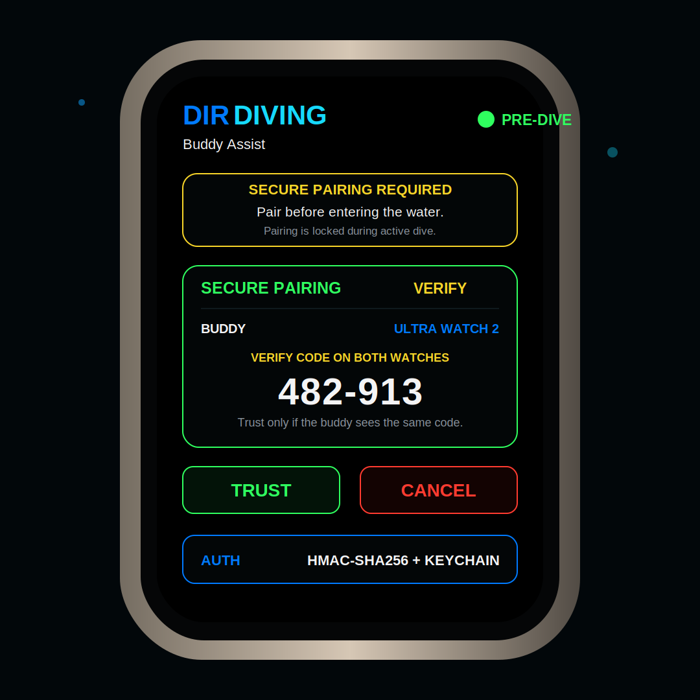
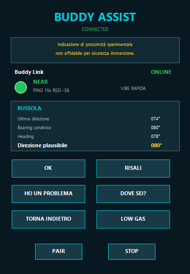

# DIR DIVING Experimental Features

This document describes the work currently living on the `codex/experimental-features` branch. These features are intentionally isolated from `main` because they are exploratory, may require hardware validation, and should not be treated as production-ready dive safety systems.

## Branch Scope

The experimental branch currently contains:

- Pre-water mode selector for Diving, Apnea, and Snorkeling.
- Premium Snorkeling runtime with waypoint navigation, return-to-entry, categorized GPS markers, and compass bearing delta.
- Premium Apnea runtime with menu, session type, open-water configuration, countdown, surface waiting, descent/bottom/ascent visual states, ascent alarm, recovery, summary, graph, details, save confirmation, logbook, and statistics surfaces.
- User-configurable ascent-rate limits.
- Buddy Assist preset messaging UI.
- Buddy Link proximity indication.
- Secure pre-dive Buddy pairing and local buddy identification.
- Experimental BLE/CoreBluetooth scaffolding.
- Buddy direction UI based on heading, shared bearing, and last known direction.
- Premium Apple Watch Ultra-style UI alignment for shared and experimental screens.

## Premium UI Alignment

The experimental branch uses the same premium visual language as the supplied Apple Watch Ultra dive-computer reference:

- Black full-screen watch canvas.
- Thin rounded technical panels instead of standard list rows.
- Large readable numeric values with monospaced digits.
- Blue labels for technical context.
- Green, yellow, orange, and red used as functional state colors.
- Custom bordered command controls instead of generic watchOS bordered buttons.
- A drawn octopus mark at the live screen top left, matching the supplied reference without depending on emoji glyphs.
- Explicit live-screen layout regions for the large depth value and the right-side ascent gauge, preventing text and gauge overlap.

The live dive screen reference preview generated from the current code is:

```text
Docs/LiveDiveImmersionPremiumPreview.png
```

The shared styling helpers live in:

```text
Views/DiveUIComponents.swift
```

## Snorkeling And Apnea Exploration

The branch implements the first integrated exploration layer from `DIR_DIVING_Integrated_Development_Specs_FINAL.docx`.

Watch implementation:

- `ModeSelectionView`: pre-water selector for Diving, Apnea, and Snorkeling.
- `SnorkelingView`: runtime, distance, average speed, waypoint navigation, bearing delta arrow, GPS status, categorized GPS marker capture, return-to-entry, and drift-oriented safety panel.
- `ApneaView`: Apnea menu, session selection, open-water configuration, countdown, surface waiting, automatic dive start from depth, surface-end handling, recovery, summary, depth profile, details, save confirmation, logbook, and statistics.
- `ExplorationStore`: shared state for mode selection, snorkeling route state, markers, apnea recovery, apnea records, and warnings.
- `ExplorationModels`: activity modes, session states, marker categories, waypoints, GPS markers, and apnea records.
- `HapticService`: confirmation, warning, notification, and countdown tick haptics gated by the experimental haptic preference.

Operational boundaries:

- GPS is treated as surface-first. Underwater navigation uses the last valid GPS fix plus compass/bearing context.
- Snorkeling waypoints and return-to-entry are situational-awareness aids, not certified underwater navigation systems.
- Apnea warning and recovery surfaces are training aids and do not replace buddy procedures, instruction, or certified safety devices.

### Latest Apnea UI Scope

The latest Apple Watch experimental Apnea work adds or restyles these screens:

- `Home Mode Selection`: Apnea entry point from the pre-water selector.
- `Apnea Menu`: `Sessione`, `Tabelle`, `Statistiche`, and `Logbook`.
- `Session Type`: `Acque Libere` active, with `Dinamica`, `Statica`, and `Personalizzata` visible as disabled placeholders.
- `Session Configuration`: allarmi reachable, intervallo superficie and profondita max configurable with local `AppStorage` persistence.
- `Countdown`: automatic `03`, `02`, `01 / VAI` flow, manual tap advance, and haptic tick/start feedback.
- `Surface Waiting`: session active in surface state before immersion.
- `Descent`, `Bottom`, and `Ascent`: visual states derived from existing depth/runtime data until a dedicated Apnea phase engine exists.
- `Ascent Alarm`: reuses `DiveManager.ascentStatus.isOverLimit` without changing ascent thresholds or algorithms.
- `Surface End`: uses `ExplorationStore.surfaceFromApnea(...)` to close the dive and start recovery.
- `Recovery`: uses the existing recovery timer and `max(duration * 2, 30)` rule.
- `Summary`, `Depth Profile`, `Details`, `Save Confirmation`, `Logbook`, and `Statistics`: complete UI path with explicit forward/back actions, real saved duration/max depth where exposed and TODO placeholders for missing samples, HR, water temperature, average depth, and aggregate metrics.
- `Watch -> iPhone Apnea`: documented sync boundary for local apnea record payloads; full WatchConnectivity queue, duplicate prevention and sample-profile sync remain TODO.

Detailed Apnea documentation is available in:

```text
Docs/APNEA_EXPERIMENTAL_SPEC.md
```

### Latest Snorkeling UI Scope

The latest Apple Watch experimental Snorkeling work adds or restyles these UI-only screens:

- `Snorkeling Live`: runtime, distance, average speed, current depth, GPS status, waypoint panel, marker, return, and BUSSOLA actions.
- `Mappa Waypoint`: current position relative to the selected/next waypoint, with a lightweight dark marine map, dashed yellow route, target marker, zoom controls, and scale indicator.
- `Mappa Ritorno`: separate return-to-entry map with cyan dashed route, home/entry marker, current marker, zoom controls, and scale indicator.
- `Direzione Waypoint`: compass-style bearing surface for waypoint navigation. It is not the generic compass screen.
- `GPS Marker`: confirmation screen for saved marker coordinates/category, GPS unavailable state, haptic confirmation/warning, and links to log/detail.
- `Dettaglio Marcatore POI`: Watch-side POI metadata detail with `Da arricchire su iPhone` and `Foto/Note: Companion iOS`.
- `Log Marcatori`: Watch-sized marker list with enrichment state and tap-to-detail.
- `Impostazioni Snorkeling`: Log Marcatori, Allarmi, Calibrazione Bussola, Legenda Icone Mappe and experimental haptics.
- `Allarmi Snorkeling`: snorkeling-specific thresholds for maximum depth, maximum time, maximum distance, and low battery persisted locally with `AppStorage`.
- `Calibrazione Bussola`: instructional screen only; it does not change compass algorithms.
- `Legenda Icone Mappe`: explains current position, waypoint, entry point, POI/marker, waypoint route and return route.

Terminology rule: use `BUSSOLA`, never `COMPASSO`.

### POI / Marker Boundary

The Watch marker action is a lightweight Point Of Interest capture, not a full editing workflow.

Expected lightweight POI payload:

- timestamp;
- last valid GPS coordinate;
- shallow/current depth if available;
- temperature if available;
- current heading/bearing if available;
- active waypoint if available;
- session id when exposed;
- enrichment state (`isEnriched = false`).

The Watch must not edit photos, videos, comments, tags, categories, species notes, or long observations. Those enrichment fields belong to the iOS Companion after sync.

Current sync boundary:

- marker payloads are persisted locally in the experimental exploration state;
- the UI clearly labels Watch -> iPhone POI sync as TODO;
- offline queue, duplicate prevention, delivery acknowledgement and iOS enrichment save are not implemented in this pass.

### Free Map / Offline Map Roadmap

For Apple Watch, the current implementation intentionally uses SwiftUI map-like visuals and does not render online tiles.

Future companion-side architecture:

- MapLibre Native or a compatible SwiftUI wrapper after device validation.
- OpenStreetMap-compatible base tiles.
- Optional OpenSeaMap marine overlay where license and usage allow it.
- MBTiles for packaged/offline cache.
- GEBCO and/or EMODnet as future bathymetry overlays.

Production apps should not hard-code heavy use of public OpenStreetMap tile servers. Prefer a self-hosted tile server, approved provider, or packaged MBTiles.

Persistence:

- The Watch experimental branch mirrors dive logs, ascent-rate settings, Snorkeling markers, Apnea records, active mode, waypoint state, and warning state to iCloud Key-Value Store when the app is signed with the iCloud capability.
- Snorkeling alarm thresholds and Apnea configuration values use local `AppStorage` as incremental experimental persistence.
- Secure Buddy keys remain in Keychain and are not copied into iCloud Key-Value Store.

Screens using this system include:

- `DiveLiveView`
- `CompassView`
- `AscentRateSettingsView`
- `BuddyAssistView`
- `DiveLogListView`
- `DiveDetailView`
- `UserImagesView`

## User-Configurable Ascent-Rate Limits

The `ASC SET` screen lets the diver adjust ascent-rate thresholds directly on Apple Watch.

Configurable bands:

| Depth band | Default |
| --- | ---: |
| 40-30 m | 10 m/min |
| 30-20 m | 5 m/min |
| 20-6 m | 3 m/min |
| 6-0 m | 1 m/min |
| Other | 10 m/min |

Settings are persisted locally with `UserDefaults` through `AscentRateSettingsStore`.

The live dive engine uses the configured values through `AscentRateLimits` when calculating `AscentStatus`.

## Buddy Assist

Buddy Assist is an experimental communication-oriented screen for pre-dive buddy identification and predefined diver-to-diver messages.

Preset messages:

- `OK`
- `RISALI`
- `HO UN PROBLEMA`
- `DOVE SEI?`
- `TORNA INDIETRO`
- `LOW GAS`

Intended concept:

```text
Apple Watch <-> BLE <-> Apple Watch
```

Current implementation:

- `BuddyAssistView`: watchOS UI for the feature.
- `BuddyAssistService`: CoreBluetooth central-side scaffold.
- `SecureBuddyStore`: Keychain-backed storage for trusted Buddy pairing material.
- `BuddyAssistMessage`: preset message model.
- `OpenBuddyAssistIntent`: App Intent intended for Action Button / shortcut-style access when watchOS exposes it.
- Received-message banner with direct `ANSWER` flow.
- Secure pre-dive pairing status with `NOT PAIRED`, `SCANNING`, `VERIFY`, `TRUSTED`, and `LOCKED`.
- Manual confirmation code before a buddy is trusted.
- Locally persisted paired buddy identity, trusted session metadata, and Keychain-stored symmetric key.
- Authenticated Buddy message envelopes using HMAC-SHA256.
- Timestamp, session, and sequence checks to reject stale or repeated messages.
- Pairing lockout while `DiveManager.isDiveActive` is true.
- Automatic cancellation of an in-progress pairing scan if a dive starts before pairing completes.
- Premium Buddy UI panels for pairing, Buddy Link, proximity, compass, received messages, answer flow, and command buttons.

### Pre-Dive Pairing Rule

Buddy pairing must be completed before entering the water.

DIR DIVING intentionally blocks pairing during an active dive and cancels any in-progress pairing scan if a dive starts before pairing completes. Pairing is a setup workflow, not an underwater operational workflow, because BLE discovery, authorization prompts, RSSI, and connection establishment are not reliable safety actions during immersion.

Mandatory UI disclaimer:

```text
Pairing solo prima dell'immersione. Non effettuare pairing in immersione.
```

## Secure Pre-Dive Pairing

Buddy Assist now requires a trusted pairing step before messages can be sent or received.

Pairing flow:

1. The diver opens `BUDDY ASSIST` before the dive.
2. `PAIR` starts BLE discovery.
3. When a candidate DIR DIVING buddy is found, the screen enters `VERIFY`.
4. Both divers compare the displayed confirmation code.
5. The diver taps `TRUST` only if the code matches on both watches.
6. DIR DIVING stores the trusted buddy key in Keychain and marks the buddy as `TRUSTED`.
7. Preset messages are enabled only after the trusted state is active.

Security behavior:

- Buddy messages are encoded as JSON envelopes rather than plain text payloads.
- Each envelope includes the trusted pairing session, sequence number, timestamp, preset message, and HMAC-SHA256 authentication code.
- The authentication key is stored in Keychain with `kSecAttrAccessibleAfterFirstUnlockThisDeviceOnly`.
- Incoming messages are rejected if they are unauthenticated, stale, repeated, or outside the trusted pairing session.
- `UNPAIR` removes the trusted buddy identity and deletes the stored key.

Pairing remains a pre-dive setup workflow. DIR DIVING does not allow a new buddy to be trusted during an active dive.

Secure pairing mockup:



## Buddy Link UI

The Buddy Assist screen now includes a dedicated Buddy Link section.

Displayed state:

- `ONLINE`: a buddy peripheral is connected.
- `LOST`: no buddy link is available.

Signal indication:

- Green dot: buddy appears near.
- Yellow dot: buddy appears distant / weaker signal but still linked.
- Red dot: no active buddy link.

The proximity indicator is based on RSSI readings. The app reads RSSI every 15 seconds while connected.

Safety warning shown in the UI:

```text
Indicazione di prossimità sperimentale non affidabile per sicurezza immersione.
```

This warning must remain visible because RSSI proximity is not a reliable underwater safety signal.

## Buddy Haptics

The experimental haptic behavior is:

- Buddy near: rapid double pulse.
- Buddy distant: slow pulse.
- Buddy message received: notification haptic for normal messages.
- Critical buddy message received: failure haptic for `HO UN PROBLEMA` and `LOW GAS`.

Implementation lives in `HapticService`:

- `buddyNearPulseIfNeeded()`
- `buddyDistantPulseIfNeeded()`

These haptics are throttled to avoid continuous vibration.

## Received Messages and Answer Flow

When a buddy message is received, the UI promotes it into a large visible banner:

- Header: `MESSAGGIO BUDDY`
- Main text: received preset message
- Critical styling for:
  - `HO UN PROBLEMA`
  - `LOW GAS`

The banner includes:

- `ANSWER`: switches the message grid into reply mode.
- `OK`: dismisses the active received message.

The reply mode uses the same preset message set:

- `OK`
- `RISALI`
- `HO UN PROBLEMA`
- `DOVE SEI?`
- `TORNA INDIETRO`
- `LOW GAS`

After sending an answer, the active received-message banner is cleared.

## Buddy Compass Block

The Buddy Assist UI includes a compass block intended to provide an "ultima direzione plausibile" view.

Displayed values:

- Last known direction.
- Shared bearing.
- Current heading.
- Plausible direction.

Current logic:

- `CompassManager` provides current heading and local bearing.
- `BuddyAssistService.updateCompassContext(...)` stores the latest compass context.
- Plausible direction currently prefers the shared bearing when available, otherwise it falls back to the last known heading.

This is a UI and state model for future validation. It is not a guaranteed buddy locator.

## BLE and watchOS Limitation

Apple documents that watchOS apps cannot advertise BLE peripheral services using `CBPeripheralManager`. This limits a pure Watch-to-Watch BLE architecture because one watch cannot reliably advertise itself as a custom BLE peripheral service for the other watch to discover.

Implication:

- The current implementation should be treated as central-side scaffolding and UI.
- A production version may require an external BLE relay, companion device, or a revised architecture tested on Apple Watch hardware.

Reference:

- Apple `CBPeripheralManager` documentation: https://developer.apple.com/documentation/corebluetooth/cbperipheralmanager

## Files Added or Modified

Main experimental files:

- `Models/AscentRateLimits.swift`
- `Services/AscentRateSettingsStore.swift`
- `Views/AscentRateSettingsView.swift`
- `Models/BuddyAssistMessage.swift`
- `Services/BuddyAssistService.swift`
- `Services/SecureBuddyStore.swift`
- `Views/BuddyAssistView.swift`
- `Models/AppPage.swift`
- `Services/AppNavigationStore.swift`
- `Services/ActionButtonIntents.swift`
- `Services/HapticService.swift`
- `Docs/BuddyAssistPreview.png`
- `Docs/SecureBuddyPairingMockup.svg`

Project configuration:

- `project.yml` includes `CoreBluetooth.framework`.
- `project.yml` includes `Security.framework`.
- `App/Info.plist` includes `NSBluetoothAlwaysUsageDescription`.

## Preview

Current static Buddy Assist preview:



## Validation Checklist

Before promoting any part of this branch to `main`:

- Generate the Xcode project with XcodeGen on macOS.
- Build the watchOS target with Xcode.
- Validate that `TabView(selection:)` works correctly with vertical page navigation on watchOS.
- Confirm App Intent availability and Action Button assignment behavior on target Apple Watch hardware.
- Test CoreBluetooth authorization and scanning behavior on watchOS.
- Validate whether any external BLE relay or companion device is required.
- Test RSSI behavior in air and controlled water conditions.
- Confirm haptic patterns are noticeable but not excessive.
- Confirm the UI remains readable on the target Apple Watch screen size.

## Latest Blocker Resolution Scope

The latest experimental UX pass resolves the audit blockers by gating or labelling unsafe surfaces instead of pretending full production capability:

- `SettingsView`, `AlarmSettingsView`, `AscentRateSettingsView` and `InfoView` are reachable from the experimental Watch navigation.
- General Watch settings persist metric-unit intent, experimental haptics, Always-On-safe intent and alarm thresholds through local `AppStorage` / existing settings stores.
- Snorkeling depth/time/distance alarms are locally enforced; the low-battery threshold is explicitly marked as configured-only until a battery source is connected.
- `DiveManager` exposes sensor availability so Watch UI can show `--` instead of valid-looking zero when depth is unavailable.
- Apnea shows `HR OFF`, `BAT --` and `TEMP --` when no heart-rate, battery or Apnea temperature source exists.
- Buddy Assist is labelled and gated as lab-only until a reliable watchOS BLE relay/companion architecture is validated.
- Experimental POI and Apnea record sync use lightweight contracts with visible queue/delivery status; this is not yet a full offline sync system.

## Safety Position

Buddy Assist and Buddy Link must not be marketed or treated as a certified dive safety communication or rescue system. The feature is experimental, currently lab-only, and should only be considered an assistive interface for future validation.
