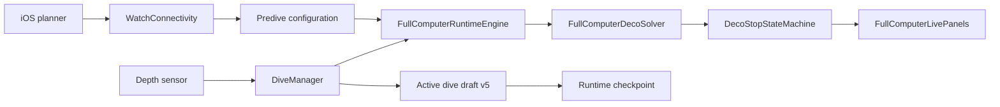

# Full Computer architecture (Watch + iOS)

**Branch:** `integration/full-computer`  
**Status:** Experimental — **not certified** for diving. See [`SAFETY_DISCLAIMER.md`](SAFETY_DISCLAIMER.md).

## Overview

Full Computer mode adds a Bühlmann-based decompressive runtime on Apple Watch while preserving Gauge mode unchanged on `main`.

| Layer | Location | Responsibility |
|-------|----------|----------------|
| Shared Bühlmann core | `Shared/BuhlmannCore/` | Planner, tissue loading, runtime projection |
| Runtime engine | `Services/FullComputerRuntimeEngine.swift` | 1 Hz tissue integration, gas switches, snapshots |
| Deco solver | `Utils/FullComputerDecoSolver.swift` | NDL / TTS / ceiling / stop schedule (copy-on-solve) |
| Stop state machine | `Utils/FullComputerDecoStopStateMachine.swift` | Hold / too shallow / too deep / violation UX |
| Gas switch policy | `Utils/FullComputerGasSwitchPolicy.swift` | Suggested / missed / unavailable gases |
| Predive configuration | `Services/FullComputerPrediveConfigurationStore.swift` | Profile draft + confirmed runtime plan |
| Persistence / recovery | `Utils/FullComputerRuntimeCheckpoint.swift`, `Services/DiveManager.swift` | Draft v5 checkpoint, logbook metadata |
| iOS plan transfer | `iOSApp/Services/FullComputerImportedPlanStore.swift` | WatchConnectivity plan package |

## Data flow

## Sync schema

- Active dive draft **schema v5** adds `fullComputerCheckpoint` and `fullComputerLogbookMetadata`.
- Legacy drafts (v4 and below) decode without checkpoint; recovery falls back to sample replay.
- Corrupt checkpoints are quarantined; diagnostics surface in the recovery banner.

## Safety gates

- Invalid gas profile / GF / self-check failures block engine startup.
- `FullComputerPrediveReadiness` blocks dive start when depth automation is unavailable.
- Non-finite depth samples mark the engine **unavailable**; `sessionDivingMode` is **not** downgraded to Gauge mid-dive.
- Degraded engine state uses conservative solver fallback; tissues are never reset silently.

## Related documents

- Command reports: `Docs/DIR_DIVING_FULL_COMPUTER_*_REPORT.md`
- Release-hard matrix: [`FULL_COMPUTER_RELEASE_HARD_TEST_MATRIX.md`](FULL_COMPUTER_RELEASE_HARD_TEST_MATRIX.md)
- Validation report: [`DIR_DIVING_FULL_COMPUTER_RELEASE_HARD_VALIDATION_REPORT.md`](DIR_DIVING_FULL_COMPUTER_RELEASE_HARD_VALIDATION_REPORT.md)
- Rollback: revert to `main` Gauge-only runtime; FC branch is isolated on `integration/full-computer`.
