# Finding Dependency Graph — CURRENT

**Baseline:** `main` @ `2c30412`  
**Orchestrator:** V1.5 @ 2026-07-01

---

## Critical dependencies

**CONS-009 / WFC-P1-001** must complete before any external TestFlight or App Store claim of decompression parity or certified planner behavior, because third-party Bühlmann validation evidence does not exist.

**CONS-010, CONS-021, CONS-022, CONS-042, CONS-048, APNEA-PHY-001** must complete before any physical Watch/iPhone/Snorkeling/Apnea field claim, because physical QA matrices are 0% executed.

**CONS-050 / WFC-P2-005** should be resolved (test alignment or documented routing policy) before treating Watch CI as fully green, because 13 routing failures block 1152/1152 PASS even though FC math tests are green.

**CONS-053 (DOC-P0 legacy claims)** must be fixed before documentation or INDEX updates assert App Store or external validation readiness, because two legacy documents contradict audit PARTIAL verdicts.

**CONS-054 (INDEX/README drift)** should follow technical truth fixes (CONS-050, physical gates) and must not precede them, because documentation must reflect known technical state per orchestrator policy §6.9.

**CONS-044 (legal/marketing)** cannot close until CONS-013 PDF physical render and CONS-009 external validation posture are honestly documented for counsel review.

---

## Mermaid graph

```mermaid
graph TD
  WFC_P1[WFC-P1-001 External Bühlmann] --> CONS_009[CONS-009]
  CONS_009 --> EXT_TF[External TestFlight claims]
  CONS_009 --> APP_STORE[App Store algorithm claims]

  WFC_P2_005[WFC-P2-005 WAO routing tests] --> CONS_050[CONS-050]
  CONS_050 --> WATCH_CI[1152/1152 Watch tests green]

  CONS_010[CONS-010 Physical FC QA] --> PHY_TF[Physical release claims]
  CONS_021[CONS-021 WAO physical] --> PHY_TF
  CONS_022[CONS-022 Underwater HW] --> PHY_TF
  CONS_042[CONS-042 Shallow wet QA] --> PHY_TF
  CONS_048[CONS-048 Snorkeling 12 QA] --> PHY_TF
  APNEA_PHY[APNEA-PHY-001 Apnea wet QA] --> PHY_TF

  CONS_053[CONS-053 P0 legacy claim docs] --> DOC_GATE[Documentation truthfulness]
  CONS_054[CONS-054 INDEX/README stale] --> DOC_GATE

  CONS_044[CONS-044 Legal sign-off] --> APP_STORE
  CONS_013[CONS-013 PDF physical render] --> CONS_044

  CONS_046[CONS-046 Script integrity] -.FIXED.-> PREFLIGHT[Audit preflight trustworthy]
  CONS_049[CONS-049 iOS tests] -.FIXED.-> IOS_CI[1655 iOS tests green]
```

---

## Batch ordering constraints

| Finding cluster | Must fix before | Because |
|-----------------|-----------------|---------|
| FC math P0 (none open) | — | 0 P0 @ 2c30412 |
| CONS-050 WFC-P2-005 | Watch suite green gate | CI regression noise |
| CONS-051 Snorkeling progress | Snorkeling routing confidence | 1 isolated test failure |
| Physical QA cluster | External TF | No simulator→physical upgrade |
| CONS-009 external | App Store deco claims | Missing third-party evidence |
| CONS-053/054 docs | Marketing/legal refresh | Docs after technical truth |

---

## Non-dependencies (keep separate)

- **WFC-P2-004 TTS 1-minute quantization** is documented conservative limitation — does not block internal TestFlight software.
- **CONS-039 Apnea cloud stub** is accepted risk — does not block Apnea software INTERNAL_READY.
- **IOS-P3 navigation restore** is UX polish — does not block safety or internal TestFlight software.
