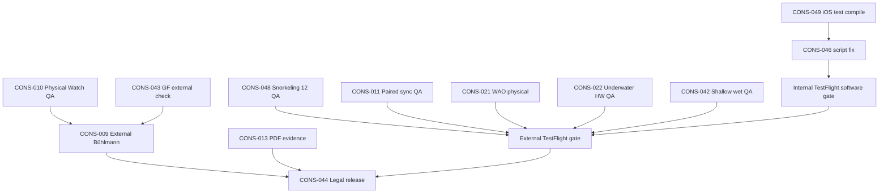

# Master Finding Dependency Graph — Current

**Orchestrator:** `00-MASTER_SUPER_ORCHESTRATOR...V1.3`  
**Baseline:** `main` @ `451f8fb` (remediation @ `5d757cc`; Snorkeling @ `dbe5d8b`)  
**Date:** 2026-06-30

---

## Summary

Post **Command 10** remediation, **Snorkeling P1/P2/P3**, and **full audit rerun 01–06 @ 451f8fb**, open work splits into: (1) **test/CI gates** — CONS-049 iOS test compile + CONS-046 script drift; (2) **evidence execution** — physical and external QA at **0%**; (3) **P3 maintainability**. Watch Full Computer **P0/P1 software = 0**. **CONS-047 closed.**

---

## Critical path (@ 451f8fb)

---

## Plain-text dependencies

| Finding | Must precede | Because |
|---------|--------------|---------|
| **CONS-049** | Internal TF unconditional; audit 02/05/07 refresh | Full iOS regression lane blocked |
| **CONS-046** | Trustworthy CI/orchestrator preflight | Script references superseded command paths |
| **CONS-010** | CONS-009, CONS-042 | Hardware depth/environment before decompression release claims |
| **CONS-011** | External TF sync sign-off | Field sync validates CONS-003..005 fixes |
| **CONS-048** | Snorkeling external TF claims | 12 open-water templates unsigned |
| **CONS-009** | App Store algorithm claims | Third-party Bühlmann compare required |
| **CONS-043** | GF release narrative (optional) | Software parity achieved — external spot-check for claims only |
| **CONS-021, CONS-022** | External TF WAO/HW gates | SOFTWARE_READY @ 451f8fb — physical validates only |

---

## Resolved dependencies (do not reopen)

| Finding | Closed @ | Unblocks |
|---------|----------|----------|
| **CONS-001** | 5d757cc | Trustworthy filename-based audit re-run |
| **CONS-002** | 5d757cc | CONS-043 external GF narrative; Watch import path |
| **CONS-003..005** | 5d757cc | CONS-011 paired QA validation |
| **CONS-006, CONS-007** | 5d757cc | CONS-042 shallow wet QA (process gates met) |
| **CONS-008, CONS-017..019** | 5d757cc | External oracle compare (CONS-009) |
| **CONS-027** | 5d757cc | — (maintainability) |
| **CONS-034** | 5d757cc partial | INDEX wave; README/matrix optional |
| **CONS-047** | 451f8fb | Snorkeling scope in domain audits |

---

## Physical QA blockers

Cannot close without hardware or field execution:

- CONS-010, CONS-011, CONS-012, CONS-021, CONS-022, CONS-023, CONS-024, CONS-025, CONS-026, CONS-029, CONS-031, CONS-032, CONS-042, CONS-045, **CONS-048**

**SOFTWARE_READY preserved:** CONS-021, CONS-022, Snorkeling route safety @ 451f8fb.

---

## External / legal blockers

- CONS-009, CONS-030, CONS-033, CONS-043, CONS-044, CONS-013

**Do not convert simulator/unit-test PASS into external validation PASS.**
