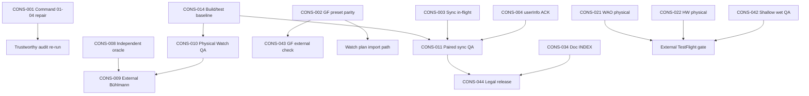

# Master Finding Dependency Graph — Current

**Orchestrator:** `00-MASTER_SUPER_ORCHESTRATOR...V1.2`  
**Baseline:** `main` @ `7dfefe2`  
**Date:** 2026-06-28

---

## Summary

At `7dfefe2`, open work splits into **three lanes**: (1) **P0 doc integrity** — command permutation blocks trustworthy re-audit; (2) **P1 software** — GF import parity, sync reliability, depth gating; (3) **evidence execution** — physical and external QA at **0%**. Watch Full Computer **P0 software safety = 0**.

---

## Critical path

---

## Plain-text dependencies

| Finding | Must precede | Because |
|---------|--------------|---------|
| **CONS-001** | Any filename-based audit re-run | Wrong body executes without repair |
| **CONS-014** | CONS-010, CONS-011, CONS-012, CONS-021, CONS-022 | Evidence campaigns need verified build/test @ HEAD |
| **CONS-002** | CONS-043, external GF/decompression claims | iOS→Watch GF must match before preset validation narrative |
| **CONS-003, CONS-004, CONS-005** | CONS-011 paired QA closure | Field sync campaign validates fixes |
| **CONS-008** | CONS-009 | External validation should use independent path or documented tolerance |
| **CONS-010** | CONS-009, CONS-042 | Hardware depth/environment before decompression release claims |
| **CONS-006, CONS-007** | CONS-042 | Shallow signing/process gates before wet shallow sign-off |
| **CONS-034** | CONS-044 | Store copy must match documented scope before legal sign-off |
| **CONS-019, CONS-020** | CONS-021 | Software WAO fixes should land before physical WAO campaign (optional ordering) |

---

## Parallel lanes (no hard dependency)

| Finding | Batch | Notes |
|---------|-------|-------|
| CONS-028, CONS-040 | Batch-3 | Navigation/settings — independent of FC math |
| CONS-027 | Batch-5 | Planner lifecycle — no safety blocker |
| CONS-035..037 | Batch-1 | P3 maintainability — after Batch 0 |
| CONS-039, CONS-041 | Batch-3/4 | Accepted/future work |

---

## Physical QA blockers

Cannot close without hardware or field execution:

- CONS-010, CONS-011, CONS-012, CONS-021, CONS-022, CONS-023, CONS-024, CONS-025, CONS-026, CONS-029, CONS-031, CONS-032, CONS-042, CONS-045

**SOFTWARE_READY preserved:** CONS-021, CONS-022 software layers PASS @ 7dfefe2.

---

## External validation blockers

- CONS-009, CONS-030, CONS-033, CONS-043, CONS-044

---

## Resolved P0 software cluster (do not regress)

Prior altitude/environment P0 verified **FIXED** @ `7dfefe2` via `OrchestratedAltitudeEnvironmentTests` and imported-plan environment propagation. Remediation must not reintroduce silent sea-level fallback.

**Watch FC forensic P0 @ 7dfefe2: 0 open.**

---

## June 2026 wave dependency note

Water auto-open, Crown/Action Button, shallow depth, and GF presets touch **Batch 1, 4, 6, 7, 8**. Physical gates (CONS-021, CONS-022, CONS-042) depend on Batch 0 baseline only — no software P0 prerequisite beyond CONS-019 optional fix.
