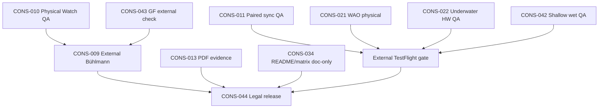

# Master Finding Dependency Graph — Current

**Orchestrator:** `00-MASTER_SUPER_ORCHESTRATOR...V1.2`  
**Baseline:** `main` @ `8ae1034` (remediation @ `5d757cc`)  
**Date:** 2026-06-29

---

## Summary

Post **Command 10** software remediation and audits **01/02/04/05/06** rerun @ `5d757cc`, open work splits into **two lanes**: (1) **evidence execution** — physical and external QA at **0%**; (2) **P3 maintainability** — navigation, settings, stop FSM. Watch Full Computer **P0/P1 software = 0**. **CONS-001 command integrity CLOSED.**

---

## Critical path (post-remediation)

---

## Plain-text dependencies

| Finding | Must precede | Because |
|---------|--------------|---------|
| **CONS-010** | CONS-009, CONS-042 | Hardware depth/environment before decompression release claims |
| **CONS-011** | External TF sync sign-off | Field sync validates CONS-003..005 fixes @ 5d757cc |
| **CONS-009** | App Store algorithm claims | Third-party Bühlmann compare required |
| **CONS-043** | GF release narrative (optional) | Software parity achieved — external spot-check for claims only |
| **CONS-034** (partial) | CONS-044 | Store copy should match documented scope before legal sign-off |
| **CONS-021, CONS-022** | External TF WAO/HW gates | SOFTWARE_READY @ 5d757cc — physical validates only |

---

## Resolved dependencies (do not reopen)

| Finding | Closed @ | Unblocks |
|---------|----------|----------|
| **CONS-001** | 5d757cc | Trustworthy filename-based audit re-run |
| **CONS-002** | 5d757cc | CONS-043 external GF narrative; Watch import path |
| **CONS-003..005** | 5d757cc | CONS-011 paired QA validation |
| **CONS-006, CONS-007** | 5d757cc | CONS-042 shallow wet QA (process gates met) |
| **CONS-008, CONS-017..019** | 5d757cc | External oracle compare (CONS-009) |
| **CONS-019** | 5d757cc | CONS-021 WAO physical (software gate applied) |
| **CONS-027** | 5d757cc | — (maintainability) |
| **CONS-034** | 5d757cc partial | INDEX wave; README/matrix optional |

---

## Parallel lanes (no hard dependency)

| Finding | Batch | Notes |
|---------|-------|-------|
| CONS-028, CONS-040 | Batch-3 | Navigation/settings — not release blockers |
| CONS-035..037 | Batch-1 P3 | Maintainability — after evidence if desired |
| CONS-039, CONS-041 | Batch-3/4 | Accepted/future work |

---

## Physical QA blockers

Cannot close without hardware or field execution:

- CONS-010, CONS-011, CONS-012, CONS-021, CONS-022, CONS-023, CONS-024, CONS-025, CONS-026, CONS-029, CONS-031, CONS-032, CONS-042, CONS-045

**SOFTWARE_READY preserved:** CONS-021, CONS-022 software layers PASS @ 5d757cc.

---

## External validation blockers

- CONS-009, CONS-030, CONS-033, CONS-043, CONS-044

---

## Stale upstream note

Audit **03 UI/UX @ 7dfefe2** — no layout changes in remediation; software-ready WAO/Crown findings remain valid. Optional rerun 03 @ HEAD does not block physical QA.

---

## June 2026 wave dependency note

Water auto-open, Crown/Action Button, shallow depth, and GF presets: **software batches COMPLETE**. Physical gates (CONS-021, CONS-022, CONS-042) depend on Batch 8 execution only.
