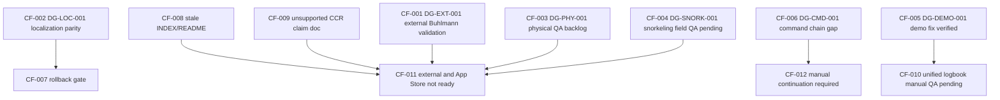

# Finding Dependency Graph — CURRENT

**Baseline:** `main` @ `7ae527b`  
**Orchestrator:** V1.7 @ 2026-07-02

---

## Critical dependencies

- `CF-002` must be fixed before `CF-007` can be fully validated because localization parity failures currently break regression confidence in Snorkeling release readiness.
- `CF-008` and `CF-009` must be fixed before `CF-011` can close because release claims and readiness language cannot be trusted while docs are stale or unsupported.
- `CF-001` must be fixed before `CF-011` can close because external/App Store decompression claims depend on independent Buhlmann validation.
- `CF-003` and `CF-004` must be fixed before `CF-011` can close because physical/manual QA evidence is a hard gate for external readiness claims.
- `CF-006` must be fixed before `CF-012` can close because command inventory integrity is required for clean post-remediation lifecycle governance.
- `CF-005` is verified and supports `CF-010`; however `CF-010` still requires manual QA completion before unified-logbook truthfulness can be considered fully closed.

---

## Mermaid graph

---

## Batch ordering constraints

| Finding cluster | Must fix before | Because |
|---|---|---|
| `DG-LOC-001` (`CF-002`) | Internal TestFlight confidence uplift | current test parity failures |
| `DG-DOC-001` + `DG-DOC-002` (`CF-008`,`CF-009`) | any release-claim refresh | truthfulness/legal baseline |
| `DG-EXT-001` (`CF-001`) | external TestFlight and App Store claims | independent validation missing |
| `DG-PHY-001` + `DG-SNORK-001` (`CF-003`,`CF-004`) | external readiness | physical/manual evidence absent |
| `DG-CMD-001` (`CF-006`,`CF-012`) | post-remediation lifecycle continuity | missing command path integrity |

---

## Non-dependencies (keep separate)

- `CF-005` is already verified (`f90b671`) and should not be reopened while unrelated physical QA work proceeds.
- `CF-014` (docs alignment debt) should not block Batch-1 quick wins.
