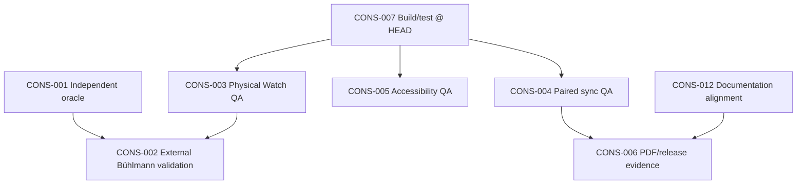

# Master Finding Dependency Graph — Current

**Orchestrator:** `00-MASTER_SUPER_ORCHESTRATOR...V1.1`  
**Baseline:** `main` @ `1f62235`  
**Date:** 2026-06-22

---

## Summary

Most open findings are **evidence gaps** (physical QA, external validation, paired-device campaigns) rather than unresolved P0 software defects. The dependency graph prioritizes **Batch 0 build verification** before trusting any release gate.

---

## Critical path

---

## Plain-text dependencies

| Finding | Must precede | Because |
|---------|--------------|---------|
| **CONS-007** | CONS-003, CONS-004, CONS-005, CONS-006 | Release evidence claims require verified build/test @ HEAD |
| **CONS-001** | CONS-002 | External validation should use independent schedule path or documented tolerance |
| **CONS-003** | CONS-002 | Hardware depth/environment must be proven before external decompression claims |
| **CONS-004** | CONS-006 | Paired sync QA supports PDF/briefing transfer release evidence |
| **CONS-012** | CONS-006 | Store copy must match documented product scope before legal/marketing sign-off |
| **CONS-008** | — | Can proceed in Batch 3 without blocking safety batches |
| **CONS-013** | — | CI stability; does not block field QA |

---

## Physical QA blockers

These findings **cannot close** without hardware or field execution:

- CONS-003, CONS-004, CONS-005, CONS-010, CONS-008 (partial)

## External validation blockers

- CONS-002, CONS-006, CONS-011

---

## Resolved P0 cluster (do not regress)

Prior altitude/environment P0 (**ALT-P0-001/002**, **UI16-P0-001**) verified **FIXED** @ `1f62235` via `OrchestratedAltitudeEnvironmentTests` and imported-plan environment propagation. Remediation must not reintroduce silent sea-level fallback.
