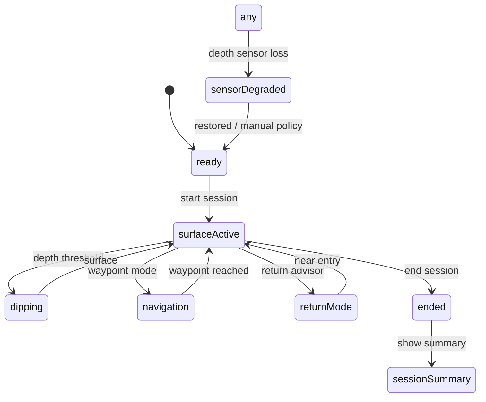

# Snorkeling architecture (Watch + iOS)

**Branch:** `main`  
**Status:** Reference-only positioning — **not certified** as a dive/snorkel computer. See [`SAFETY_DISCLAIMER.md`](SAFETY_DISCLAIMER.md).

## Overview

Snorkeling mode runs on Apple Watch as the **authoritative session runtime**. iOS is the **companion** for profiles, route planning, logbook, analytics, export, and Watch sync.

| Layer | Location | Responsibility |
|-------|----------|----------------|
| Domain models | `Shared/Models/Snorkeling*.swift` | Session, dips, GPS track, route, markers, profiles |
| Lifecycle engine | `Shared/Utils/SnorkelingSessionEngine.swift`, `SnorkelingLifecycleStateMachine.swift` | Ready → surface → dip → navigation → return → summary |
| GPS ingestion | `Shared/Utils/SnorkelingSensorGPSIngestion.swift` | Measured surface fixes only; underwater unavailable |
| Navigation / return | `Shared/Utils/SnorkelingNavigationEngine.swift`, `SnorkelingReturnAdvisor.swift` | Waypoint bearing, return-to-entry advisor |
| Watch presentation | `Utils/SnorkelingWatchPresentation.swift`, `Views/SnorkelingView.swift` | Seven stages mapped to mockups |
| Watch logbook | `Services/SnorkelingLogbookStore.swift` | Local persistence + outbound session sync |
| iOS companion | `iOSApp/Views/Snorkeling/`, `iOSApp/Services/IOSSnorkeling*.swift` | Dashboard, planner, logbook, export |
| Route sync (iOS → Watch) | `SnorkelingRouteSyncCodec`, `snorkelingRoutePackage` | Signed package + ACK |
| Session sync (Watch → iOS) | `SnorkelingSessionSyncCodec`, `dirdiving_snorkeling_session_sync` | HMAC v2 transport + signed ACK |

## State machine

Watch UI stages (`SnorkelingWatchStage`) map 1:1 to reference mockups in `mockups/Apple_Watch/SNORKELING_WATCH_0*.png`.

## Sync namespaces

| Channel | Key / type | Direction |
|---------|------------|-----------|
| Checkpoint | `dirdiving_snorkeling_session` | Watch internal |
| Route package | `snorkelingRoutePackage` | iOS → Watch |
| Route ACK | `snorkelingRoutePackageAck` | Watch → iOS |
| Session transport | `dirdiving_snorkeling_session_sync` | Watch → iOS |
| Logbook store | `dirdiving_snorkeling_sessions` | iOS local |
| Gauge dive | `dirdiving_dive_session` | isolated |
| Apnea | `dirdiving_apnea_session` | isolated |
| Full Computer | `fullComputerPlanPackage` | isolated |

## GPS and map policy

- Only **measured surface** fixes create map polylines and GPX exports.
- Gaps > **30 s** split segments (`SnorkelingSessionMapPresentation`) — no false bridges.
- Underwater coordinates are **never** plotted as measured GPS.
- Dashboard and session detail share the same gap-aware segmentation.

## Safety gates

- **Sensor unavailable:** `SnorkelingWatchPresentation` disables start (`snorkeling.ready.sensor_unavailable`).
- **No fake metrics:** no heatmap, readiness score, fatigue, or offline-map-ready without cache.
- **Sync truth:** route `acknowledged` only after signed ACK; session import reports real `imported` / `duplicateIgnored` / `failed`.
- **Privacy:** GPS export requires explicit acknowledgement; photo EXIF GPS stripped via `SnorkelingPhotoMetadataSanitizer`.
- **Feature flag:** snorkeling integration gated by project target membership and `DIRModesAndStartup` routing.

## Visual reference index

| Mockup | Stage / surface |
|--------|-----------------|
| `SNORKELING_WATCH_01_READY` | `ready` |
| `SNORKELING_WATCH_02_SURFACE_DASHBOARD` | `surfaceDashboard` |
| `SNORKELING_WATCH_03_DIP_IN_PROGRESS` | `dipInProgress` |
| `SNORKELING_WATCH_04_WAYPOINT_NAVIGATION` | `navigation` |
| `SNORKELING_WATCH_05_RETURN_TO_ENTRY` | `returnToEntry` |
| `SNORKELING_WATCH_06_SAVE_MARKER` | `saveMarker` |
| `SNORKELING_WATCH_07_SESSION_SUMMARY` | `sessionSummary` |
| `SNORKELING_IOS_01_DASHBOARD` | `IOSSnorkelingDashboardView` |
| `SNORKELING_IOS_02_ROUTE_PLANNER` | `IOSSnorkelingRoutePlannerView` |
| `SNORKELING_IOS_03_SESSION_DETAIL` | `IOSSnorkelingSessionDetailView` |

Raster PNGs live under `mockups/**` only — **never** in app bundles (`SnorkelingMockupReferenceMatrix`, `MockupCanonicalPaths`).

## Related contracts

- [`SNORKELING_NAVIGATION_RETURN_ENGINE_CONTRACT.md`](SNORKELING_NAVIGATION_RETURN_ENGINE_CONTRACT.md)
- [`SNORKELING_PERSISTENCE_RECOVERY_CONTRACT.md`](SNORKELING_PERSISTENCE_RECOVERY_CONTRACT.md)
- [`DIR_DIVING_SNORKELING_IOS_WATCH_SYNC_PROTOCOL_IMPLEMENTATION_REPORT_CURRENT.md`](DIR_DIVING_SNORKELING_IOS_WATCH_SYNC_PROTOCOL_IMPLEMENTATION_REPORT_CURRENT.md)
