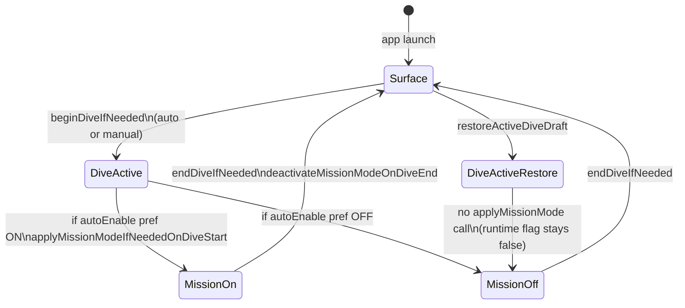

# Watch MAIN — Low Power / Mission Mode Implementation Audit

**Date:** 2026-05-29  
**Branch:** `main` @ `4875b56`  
**Target:** Apple Watch MAIN only (`DIRDiving Watch App`)  
**Task type:** Audit only (no code changes)  
**Auditor:** Cursor agent (repository static analysis)

---

## A. Executive Summary

| Question | Answer |
|----------|--------|
| Is Low Power / Mission Mode implemented? | **Yes — as DIR DIVING internal Mission Mode** (app-level UI/runtime profile). **No** Apple Watch system Low Power Mode control or detection. |
| Readiness score | **~75%** |
| Settings exposure | **Partial** — one persisted toggle: *Auto-enable on dive start* (default OFF). No manual on/off during a dive, no “what it does vs Apple LPM” disclaimer in Settings copy. |
| Automatic activation during dive | **Yes** on normal dive start (auto depth + manual `Start Dive`) when preference is ON. **Gap:** active-dive draft restore does **not** re-apply Mission Mode. |
| Apple system vs internal | **Internal Mission Mode only.** No public watchOS API usage to enable system Low Power Mode. Product docs (`MISSION_MODE_MAIN_WATCH.md`, `WATCH_MAIN_UX_CONVENTIONS.md`, `SAFETY_DISCLAIMER.md`) correctly scope Mission Mode as UI/runtime optimization, but Settings footnotes do not explicitly disclaim Apple system Low Power Mode. |
| Functional power savings | **Limited and UI-focused** — disables some SwiftUI animations and decorative shadows on **Live** and **Compass** only. Does **not** change GPS/depth sampling, haptics, brightness, Always-On, WatchConnectivity, or logging. `uiRefreshInterval` exists in profile but is **unused** (same value for standard and mission). |
| Battery alarm | **Separate feature** — low-battery warning/blink in `DiveManager` + `AlarmSettingsView`; not Mission Mode. |
| Classification | **2 — Implemented but not fully exposed in Settings** (with **4**-like gap on draft restore and **3**-like limited runtime effect) |
| TestFlight ready (if Mission Mode is advertised)? | **Conditional yes** — feature exists and matches release checklist toggle; manual control and draft-restore gap should be documented in release notes or fixed before strong marketing of “power saving.” |
| App Store ready? | **Conditional yes** — add explicit copy that Mission Mode ≠ Apple system Low Power Mode (recommended wording in §G); no false system-LPM claims found in code. |

**Bottom line:** The user’s expectation is correct: **Mission Mode already exists in code** with auto-enable Settings, lifecycle hooks, and a live bolt indicator. It is **not** Apple’s system Low Power Mode. Settings **partially** expose configuration (auto on dive start only). **Manual** activation/deactivation during a dive is **not** implemented.

---

## B. Scope Confirmation

### Preflight (Phase 0)

| Check | Result |
|-------|--------|
| Current branch | `main` |
| Working tree | Clean (`git status --short` empty) |
| HEAD | `4875b56` |
| Watch target name | `DIRDiving Watch App` (`project.yml` → product `DIRDivingWatchApp`) |
| Watch source roots | `App`, `Models` (with excludes), `Services` (with excludes), `Views` (with excludes), `Utils` (with excludes), explicit algorithm/utils files, `Resources` |
| Experimental excluded from Watch MAIN | `ExplorationModels.swift`, `BuddyAssistMessage.swift`, `BuddyPairingHandshake.swift`, `ExplorationStore.swift`, `BuddyAssistService.swift`, `BuddyAssistPeripheralService.swift`, `BuddyPairingKeyAgreement.swift`, `SecureBuddyStore.swift`, `ApneaView.swift`, `SnorkelingView.swift`, `BuddyAssistView.swift`, `ExperimentalConceptsView.swift`, `ExperimentalFeatures.swift` |
| Code modified by this audit | **None** (this document only) |

### Inspected files (primary)

`Utils/MissionModeRuntimeProfile.swift`, `Views/MissionModeIndicatorView.swift`, `Views/SettingsView.swift`, `Views/DiveLiveView.swift`, `Views/CompassView.swift`, `Services/DiveManager.swift`, `Services/GPSManager.swift`, `Services/HapticService.swift`, `Services/AscentSafetyHapticCoordinator.swift`, `Services/DepthLimitHapticCoordinator.swift`, `Utils/WatchAlarmDefaults.swift`, `Utils/DiveAlgorithmConfiguration.swift`, `Models/AppPage.swift`, `Views/InfoView.swift`, `Views/WatchShortcutHelpView.swift`, `App/DIRDivingApp.swift`, `project.yml`, `Resources/en.lproj/Localizable.strings`, `Resources/it.lproj/Localizable.strings`, `Docs/MISSION_MODE_MAIN_WATCH.md`, `Docs/WATCH_MAIN_UX_CONVENTIONS.md`, `Docs/SAFETY_DISCLAIMER.md`, `Docs/RELEASE_CHECKLIST.md`.

### Out of scope (untouched)

Snorkeling, Apnea, Buddy, Exploration Lab, iOS MAIN, experimental branches, `MissionModeService.swift` (referenced in stale audit doc `DIR_DIVING_WATCH_ALGORITHM_MATH_AUDIT.md` but **not present** on `main`).

---

## C. Implementation Inventory

| File | Symbol / property | Role | Implemented behavior | Persisted? | UI exposed? | During active dive? | Notes |
|------|-------------------|------|----------------------|------------|-------------|---------------------|-------|
| `Utils/MissionModeRuntimeProfile.swift` | `MissionModeSettings.autoEnableOnDiveStartKey` | Preference key | `dirdiving.missionMode.autoEnableOnDiveStart` | Yes (`UserDefaults` / `@AppStorage`) | Via Settings toggle | N/A | Default OFF in UI binding |
| `Utils/MissionModeRuntimeProfile.swift` | `MissionModeRuntimeProfile` | Runtime profile | `standard` vs `mission`: `animationsEnabled`, `decorativeEffectsEnabled`; `uiRefreshInterval` = 1.0 both | No (computed at runtime) | Indirect | When `isMissionModeActive` | `uiRefreshInterval` **never read** elsewhere |
| `Services/DiveManager.swift` | `isMissionModeActive` | Runtime flag | Set true if auto-enable pref on dive start; false on dive end | **No** (not in `ActiveDiveDraft`) | Indicator only | Yes | `private(set)` — no public toggle API |
| `Services/DiveManager.swift` | `missionModeRuntimeProfile` | Profile selector | `.mission` if active else `.standard` | No | No | Yes | |
| `Services/DiveManager.swift` | `applyMissionModeIfNeededOnDiveStart()` | Activation | `isMissionModeActive = missionModeAutoEnableOnDiveStart` | Pref only | No | Called from `beginDiveIfNeeded` | Not called from draft restore |
| `Services/DiveManager.swift` | `deactivateMissionModeOnDiveEnd()` | Deactivation | `isMissionModeActive = false` | Pref unchanged | No | On `endDiveIfNeeded` | |
| `Services/DiveManager.swift` | `ActiveDiveDraft` | Crash/relaunch persistence | Dive samples, GPS, manual flag, depth flags — **no** mission flag | Partial (dive state) | No | Restore path | Restore **skips** Mission Mode activation |
| `Views/SettingsView.swift` | `missionModeControl` | Settings UI | Toggle + footnote | Yes | Yes | Blocked when `dive.isDiveActive` | Auto-enable only |
| `Views/MissionModeIndicatorView.swift` | bolt icon | Status indicator | 8pt `bolt.fill`, localized a11y | No | Live header only | Yes, if mission active | No text label on screen |
| `Views/DiveLiveView.swift` | `missionModeProfile` usage | UI optimization | Fewer animations; shadows off on metric blocks | No | Live screen | Yes | Safety banners/alarms still shown |
| `Views/CompassView.swift` | `missionModeActiveForCurrentDive` | UI optimization | Heading/bearing/toast animations off; decorative shadow off | No | Compass | Yes | |
| `Services/DiveManager.swift` | Battery alarm (`AlarmBlinkSource.battery`) | Separate alarm | Blink + message when level &lt; threshold | Yes (alarm prefs) | `AlarmSettingsView` | Yes | Independent of Mission Mode |
| `Services/GPSManager.swift` | — | GPS | No Mission Mode branches | — | — | — | |
| `Services/HapticService.swift` | — | Haptics | No Mission Mode branches | — | `settings.haptics` toggle | — | |
| `Docs/MISSION_MODE_MAIN_WATCH.md` | — | Product doc | Full behavior spec | — | — | — | Aligns with code |
| `App/DIRDivingApp.swift` | — | App entry | No Mission Mode logic | — | — | — | |
| `Views/InfoView.swift` | `batteryRow` | Diagnostics | Displays battery % bar | No | Info screen | Always | Not Mission Mode |
| `Views/WatchShortcutHelpView.swift` | — | Help | No Mission Mode mention | — | — | — | |
| `Tests/**` | — | Tests | **No** Mission Mode unit/UI tests | — | — | — | |

### Search term summary (Phase 1)

| Term family | Watch MAIN code hits |
|-------------|---------------------|
| `LowPower`, `low power`, `basso consumo`, `powerSaving` | **None** in Swift |
| `Mission`, `MissionMode`, `MissionModeRuntimeProfile` | **Yes** — core implementation |
| `ProcessInfo` / `isLowPowerModeEnabled` | **None** (only `MonotonicElapsedClock` uses uptime) |
| GPS/sensor interval / brightness / alwaysOn tied to mission | **None** |

---

## D. Settings Exposure Report

### Present in Settings (`SettingsView`)

| Control | Present? | Persisted key | Applied? | Localized (EN/IT)? | Blocked during dive? |
|---------|----------|---------------|----------|-------------------|----------------------|
| Mission Mode section title | Yes | — | — | Yes (`settings.mission_mode.title`) | — |
| Auto-enable on dive start | Yes | `dirdiving.missionMode.autoEnableOnDiveStart` | Yes, on next dive start | Yes | Yes (`.disabled(dive.isDiveActive)`) |
| Footnote (what it does) | Yes | — | Informational | Yes | Same |
| Manual enable Mission Mode now | **No** | — | — | — | — |
| Manual disable Mission Mode now | **No** | — | — | — | — |
| Current Mission Mode on/off status row | **No** | — | — | — | Live bolt only |
| Apple system Low Power Mode disclaimer | **No** | — | — | — | — |
| Distinction vs haptics-off / battery alarms | **No** explicit row | Separate toggles exist | Partially implicit | Partial | — |

### User checklist (Phase 3)

| # | Capability | Status |
|---|------------|--------|
| 1 | Enable Mission Mode manually (during dive) | **Missing** |
| 2 | Disable Mission Mode manually (during dive) | **Missing** |
| 3 | Enable automatic Mission Mode when dive starts | **Implemented** (toggle, default OFF) |
| 4 | Disable automatic Mission Mode when dive starts | **Implemented** (toggle OFF) |
| 5 | Configure what Mission Mode changes | **Partial** — footnote mentions reduced non-essential visual activity; no bullet list, no “does not affect GPS/sampling” in Settings |
| 6 | See current Mission Mode status | **Partial** — bolt on Live only when active; nothing in Settings |
| 7 | Understand Apple LPM vs Mission vs battery vs haptics | **Partial** — docs (`SAFETY_DISCLAIMER`, `MISSION_MODE_MAIN_WATCH`); Settings does not explain Apple LPM |

### Misleading / stale items

| Item | Assessment |
|------|------------|
| Settings footnote | **Truthful but incomplete** — does not state “not Apple Low Power Mode” |
| README / marketing “power saving” language | Generally describes “runtime/UI optimization”; avoid equating to system LPM in store copy |
| `DIR_DIVING_WATCH_ALGORITHM_MATH_AUDIT.md` | **Stale** — references non-existent `MissionModeService.swift` |
| Release checklist | Expects toggle visible — **met** |

---

## E. Automatic Dive Activation Report

| Event | Mission Mode behavior | Status |
|-------|----------------------|--------|
| Automatic dive start (submersion) | `beginDiveIfNeeded` → `applyMissionModeIfNeededOnDiveStart()` | **Implemented** |
| Manual dive start (`startManualDive`) | Same path | **Implemented** |
| Dive end (auto or manual) | `deactivateMissionModeOnDiveEnd()` | **Implemented** |
| App relaunch + active dive draft restore | `restoreActiveDiveDraftIfAvailable()` sets `isDiveActive` but **does not** call `applyMissionModeIfNeededOnDiveStart()` | **Gap / partial** |
| Mission left on after dive | Cleared on end | **OK** |
| UI indicator | `DiveLiveView` shows `MissionModeIndicatorView` when `isDiveActive && isMissionModeActive` | **Implemented** |
| Settings state vs runtime | Only preference persisted; runtime flag ephemeral | **By design** (documented) |
| Logging / analytics for Mission Mode | None found | **Missing** |

### Lifecycle diagram



---

## F. Functional Effects Report

| Effect area | Implemented? | File / mechanism | During dive? | Outside dive? | User-visible? | Documented? |
|-------------|--------------|------------------|--------------|---------------|---------------|-------------|
| GPS sampling / capture | **No** | — | — | — | — | Docs say excluded |
| Depth sampling | **No** | — | — | — | — | Docs say excluded |
| Screen refresh / `uiRefreshInterval` | **No** (field unused) | `MissionModeRuntimeProfile` | — | — | — | — |
| SwiftUI animations (Live) | **Yes** | `DiveLiveView` `.animation(...)` gated by profile | Yes | N/A (only when dive+mission) | Subtle | Yes |
| SwiftUI animations (Compass) | **Yes** | `CompassView` | Yes | N/A | Subtle | Yes |
| Decorative shadows/glow | **Yes** | `DiveLiveView`, `CompassView` | Yes | — | Subtle | Yes |
| Haptic cadence | **No** | Independent `dirdiving_watch_haptics_enabled` | — | — | — | — |
| Alarm cadence | **No** | `DiveManager` alarms unchanged | — | — | — | — |
| Display brightness | **No** | — | — | — | — | — |
| Always-On display | **No** | — | — | — | — | — |
| WatchConnectivity | **No** | — | — | — | — | — |
| Logging frequency | **No** | — | — | — | — | — |
| Battery alarm thresholds | **No** | Separate UserDefaults keys | — | — | — | — |
| Charts / other Watch views | **No** | Only Live + Compass | — | — | — | — |
| Workout / extended runtime session | **No** | — | — | — | — | — |

**Classification note:** Mission Mode is **not** “UI indicator only” — confirmed runtime UI effect exists — but effect magnitude is **small** (animation/shadow reduction only). Not a hardware-level power profile.

---

## G. Platform / API Truthfulness Report

| Question | Finding |
|----------|---------|
| Public watchOS API to **enable** system Low Power Mode? | **Not used.** No entitlement or private API found. |
| System Low Power Mode **detection**? | **Not implemented** (`ProcessInfo.isLowPowerModeEnabled` not referenced). |
| Behavior scope | **App-level Mission Mode only** |
| Documentation falsely implies Apple system LPM? | **Code: no.** **Settings strings: ambiguous** (name “Mission Mode” without disclaimer). **Product docs: clear** that it is internal UI/runtime optimization. |
| App Store review risk | **Low–medium** if marketing calls it “Low Power Mode”; **low** if copy matches internal profile + disclaimer. |

### Recommended wording (do not implement in this audit)

**IT:**  
“Modalità Missione: profilo interno DIR DIVING per ridurre elementi non essenziali durante l’immersione. Non attiva la modalità Basso Consumo di sistema di Apple Watch.”

**EN:**  
“Mission Mode: DIR DIVING internal runtime profile to reduce non-essential behavior during a dive. It does not enable Apple Watch system Low Power Mode.”

---

## H. Edge Case Audit (Phase 7)

| Scenario | Result |
|----------|--------|
| User enables auto Mission Mode | Pref saved; next dive start activates | **Implemented** |
| User disables auto Mission Mode | Pref saved; dive starts without mission | **Implemented** |
| Dive starts automatically | Mission applied per pref | **Implemented** |
| Dive starts manually | Same | **Implemented** |
| Dive ends automatically / manually | Mission deactivated | **Implemented** |
| App relaunch during active dive (draft) | Dive restored; **Mission Mode stays off** even if pref ON | **Partial / bug-class gap** |
| Haptics disabled globally | Mission unaffected; haptics still respect global toggle | **OK** (independent) |
| GPS unavailable | Mission unaffected | **OK** |
| Battery alarm active | Independent blink/message | **OK** |
| Watch enters **system** Low Power Mode | App does not detect or react | **N/A / not integrated** |
| User changes Mission pref on surface | Takes effect next dive | **Implemented** |
| User changes Mission pref during dive | Control disabled | **Blocked** (cannot change pref underwater) |
| User tries manual Mission on/off during dive | **Impossible** (no UI/API) |

---

## I. Classification & Readiness Score

**Primary classification:** **2 — Implemented but not fully exposed in Settings**

Supporting notes:

- Not **1** — missing manual controls and full explanatory Settings copy  
- Not **3** only — runtime effects exist beyond icon  
- Not **5** — Mission Mode is separate from battery alarm  
- Not **6** or **7** — real code path exists  

**Readiness score: 75%**

| Criterion | Weight | Status |
|-----------|--------|--------|
| Internal implementation | High | Done (UI profile + lifecycle) |
| Settings exposure | High | Partial (auto-enable only) |
| Persistence | Medium | Pref yes; runtime no; draft gap |
| Automatic dive activation | High | Yes except draft restore |
| Truthful copy | Medium | Docs good; Settings incomplete |
| Tests | Medium | None |

---

## J. Missing Pieces

1. Manual Mission Mode toggle (during active dive or surface “force on next session”)  
2. Settings status row (“Mission Mode will auto-start on dive” / “Active now”)  
3. Explicit Apple system Low Power Mode disclaimer in Settings (+ optional Info)  
4. `restoreActiveDiveDraftIfAvailable()` should call `applyMissionModeIfNeededOnDiveStart()` when restoring active dive  
5. Wire or remove dead `uiRefreshInterval` field  
6. Unit tests: lifecycle + draft restore + no impact on sample count  
7. Fix stale `DIR_DIVING_WATCH_ALGORITHM_MATH_AUDIT.md` reference to `MissionModeService`  
8. Optional: detect `ProcessInfo.processInfo.isLowPowerModeEnabled` for informational display only (no activation)  

---

## K. Priority Plan

### P0 — Before TestFlight if “power saving / Mission Mode” is prominently advertised

| Issue | Proposed solution | Files | Effort | Risk | Acceptance criteria |
|-------|-------------------|-------|--------|------|---------------------|
| Draft restore skips Mission Mode | After successful draft restore, call `applyMissionModeIfNeededOnDiveStart()` | `Services/DiveManager.swift` | S | Low | Relaunch mid-dive with auto-enable ON shows bolt + reduced animations |
| Misleading “Low Power” store copy | Use recommended IT/EN disclaimer in Settings footnote + App Store description | `Resources/*.lproj`, metadata | S | Low | No claim of enabling Apple system LPM |

### P1 — Before App Store

| Issue | Proposed solution | Files | Effort | Risk | Acceptance criteria |
|-------|-------------------|-------|--------|------|---------------------|
| No manual Mission control | Add surface-only “Enable for this dive” if auto off, or in-dive toggle with safety review | `DiveManager`, `SettingsView` or `DiveLiveView` | M | Med | User can turn Mission on/off without ending dive |
| Settings clarity | Expand footnote: lists what changes (animations/shadows) and what does not (GPS, depth, haptics, alarms) | `Localizable.strings`, `SettingsView` | S | Low | QA checklist passes |
| No automated tests | Add `WatchMissionModeTests` or extend algorithm test target | New test file, `project.yml` | M | Low | Tests cover start/end/restore |

### P2 — Nice-to-have

| Issue | Proposed solution | Files | Effort | Risk | Acceptance criteria |
|-------|-------------------|-------|--------|------|---------------------|
| Unused `uiRefreshInterval` | Implement throttled UI timer or remove field | `MissionModeRuntimeProfile`, consumers | M | Med | Measurable fewer view updates OR field removed |
| Broader view coverage | Apply profile to `AscentGaugeView`, log list, etc. | Various `Views/` | M | Med | Consistent behavior |
| System LPM informational row | Read-only Info row when `isLowPowerModeEnabled` | `InfoView` | S | Low | Display only, no activation |

### P3 — Future

| Issue | Proposed solution | Files | Effort | Risk | Acceptance criteria |
|-------|-------------------|-------|--------|------|---------------------|
| True power profiling | Instruments battery test on hardware; quantify savings | Docs + QA | L | Low | Documented % or “negligible” |
| Shortcuts / Action Button | Intent to flip Mission Mode | `ActionButtonIntents` | M | Med | Works on supported watches |

---

## L. Final Verdict

| Question | Answer |
|----------|--------|
| Is Low Power / Mission Mode implemented? | **Yes** — internal Mission Mode with UI/runtime optimizations and lifecycle hooks. **Not** Apple system Low Power Mode. |
| Is it exposed in Settings? | **Partially** — auto-enable on dive start only. |
| Can the user enable automatic activation during dive? | **Yes** — via Settings toggle (default OFF). |
| Is it safe and truthful? | **Safe** — does not alter dive math, sampling, or safety alerts per code and docs. **Truthfulness** — good in technical docs; Settings should add Apple LPM disclaimer. |
| TestFlight ready? | **Yes with caveats** — document draft-restore gap; avoid calling it system Low Power Mode. |
| App Store ready? | **Yes with copy review** — implement P0 disclaimer before marketing as “low power.” |
| What blocks 100% readiness? | Manual control, draft-restore activation, explicit Settings/legal copy, tests, limited actual battery impact, unused `uiRefreshInterval`. |

---

## M. Recommended Implementation Command (draft — do not execute)

```text
CURSOR COMMAND — WATCH MAIN MISSION MODE COMPLETION (IMPLEMENTATION)

Repository: DirDiving-App
Branch: main
Target: DIRDiving Watch App only
Do NOT touch: experimental modes, iOS MAIN, Buddy/Snorkel/Apnea/Exploration files excluded in project.yml

GOALS:
1. Fix draft restore: after restoreActiveDiveDraftIfAvailable(), call applyMissionModeIfNeededOnDiveStart() when isDiveActive.
2. Settings: add IT/EN footnote that Mission Mode is DIR DIVING internal profile and does NOT enable Apple Watch system Low Power Mode (use audit-recommended strings).
3. Settings: optional read-only row showing auto-enable pref + whether Mission is active this session (surface only).
4. Optional P1: manual Mission Mode toggle on DiveLiveView (surface before dive OR during dive with UX review) — wire to new DiveManager methods setMissionModeActive(_:) respecting isDiveActive.
5. Remove or implement uiRefreshInterval (prefer remove if no consumer planned in this PR).
6. Add unit tests for apply/deactivate/restore paths; assert sample/logging paths unchanged when mission toggles.
7. Update stale DIR_DIVING_WATCH_ALGORITHM_MATH_AUDIT.md reference (MissionModeService → DiveManager + MissionModeRuntimeProfile).

ACCEPTANCE:
- Auto-enable ON: manual + auto dive start show bolt indicator and reduced Live/Compass animations.
- Kill app mid-dive, relaunch: draft restores AND Mission Mode matches pref.
- Dive end: isMissionModeActive false; pref unchanged.
- Settings disabled during dive; disclaimer visible on surface.
- xcodegen generate && build Watch scheme succeeds; new tests pass.

DO NOT: call private APIs for system Low Power Mode; change depth/GPS/haptic/alarm logic; modify excluded experimental files.
```

---

*End of audit report.*
