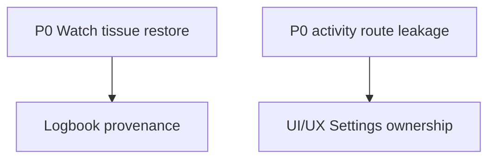

# 00 — MASTER CURSOR / CODEX COMMAND — DIR DIVING SUPER ORCHESTRATOR — FULL AUDIT SEQUENCE AND NON-REGRESSIVE REMEDIATION PLAN — V1.3

**Repository:** `egopfe/DirDiving-App`  
**Required branch:** `main`  
**Task type:** audit-output orchestration, consolidation, deduplication, prioritization and non-regressive remediation planning  
**Execution mode:** read-only, no production changes, no fixes, no refactor, no commits, no push  
**Command number:** `00`  
**Command version:** `V1.3`  
**Must be launched first and alone from the Git repository root.**  

This command is the single top-level orchestrator. It must instruct Cursor/Codex to run the master audit commands in the correct order, collect their outputs, then consolidate all results into one non-regressive remediation plan.

**Canonical command directory inside the Git repository:**

```text
commands_for_cursor/
```

The orchestrator must treat `commands_for_cursor/` as the canonical source for all subcommands.

**Internal launch sequence managed by this orchestrator:**  

```text
01-MASTER_WATCH_FULL_COMPUTER_FORENSIC_AUDIT_COMMAND_V2.2.md
02-MASTER_IOS_FULL_DEEP_COMPREHENSIVE_AUDIT_COMMAND_V1.2.md
03-MASTER_UI_UX_FULL_DEEP_COMPREHENSIVE_AUDIT_COMMAND_V2.3.md
04-MASTER_MAIN_CODE_SYNC_SECURITY_PERFORMANCE_AUDIT_COMMAND_V1.2.md
05-MASTER_RELEASE_QA_EVIDENCE_COMPLIANCE_AUDIT_COMMAND_V1.2.md
06-MASTER_DOCUMENTATION_REPOSITORY_ALIGNMENT_AUDIT_COMMAND_V1.2.md
07-MASTER_POST_REMEDIATION_CODE_READINESS_VERIFICATION_AUDIT_COMMAND_V1.0.md
```

---

# 0. ABSOLUTE EXECUTION RULE

This command is **not** a remediation command. It is the first command to launch. It orchestrates the full audit sequence and then consolidates the audit results.

This command must **not** modify:

- production code;
- tests;
- project configuration;
- assets;
- mockups;
- localization resources;
- algorithms;
- Bühlmann;
- Schreiner;
- Haldane;
- Gradient Factors;
- decompression schedule;
- gas logic;
- CCR / Rebreather logic;
- Ratio Deco logic;
- sync schemas;
- persistence schemas;
- security model;
- UI/UX;
- documentation outside the requested orchestrator outputs;
- Git history.

Do **not**:

- refactor;
- apply fixes;
- change UI;
- change business logic;
- change algorithms;
- change target membership;
- change settings;
- change schemas;
- change docs except the requested orchestrator outputs;
- commit;
- push;
- merge;
- close findings;
- mark unresolved issues as fixed.

This command may only create or update the requested consolidated reports under `Docs/`.

If a required upstream audit output is missing, stale, incomplete or inconsistent, do **not** invent results. Mark:

```text
MISSING_UPSTREAM_AUDIT_OUTPUT
STALE_UPSTREAM_AUDIT_OUTPUT
INCOMPLETE_UPSTREAM_AUDIT_OUTPUT
CONFLICTING_UPSTREAM_AUDIT_OUTPUT
```

---

# 0A. FIRST-LAUNCH BEHAVIOR

This command must be launched from the Git repository root.

Before doing anything else, Cursor/Codex must verify that the following directory exists:

```text
commands_for_cursor/
```

The orchestrator must load the subcommands from:

```text
commands_for_cursor/01-MASTER_WATCH_FULL_COMPUTER_FORENSIC_AUDIT_COMMAND_V2.2.md
commands_for_cursor/02-MASTER_IOS_FULL_DEEP_COMPREHENSIVE_AUDIT_COMMAND_V1.2.md
commands_for_cursor/03-MASTER_UI_UX_FULL_DEEP_COMPREHENSIVE_AUDIT_COMMAND_V2.3.md
commands_for_cursor/04-MASTER_MAIN_CODE_SYNC_SECURITY_PERFORMANCE_AUDIT_COMMAND_V1.2.md
commands_for_cursor/05-MASTER_RELEASE_QA_EVIDENCE_COMPLIANCE_AUDIT_COMMAND_V1.2.md
commands_for_cursor/06-MASTER_DOCUMENTATION_REPOSITORY_ALIGNMENT_AUDIT_COMMAND_V1.2.md
07-MASTER_POST_REMEDIATION_CODE_READINESS_VERIFICATION_AUDIT_COMMAND_V1.0.md
```

The orchestrator itself should also be stored in:

```text
commands_for_cursor/00-MASTER_SUPER_ORCHESTRATOR_FULL_AUDIT_SEQUENCE_AND_NON_REGRESSIVE_REMEDIATION_PLAN_COMMAND_V1.3.md
```

If the directory or any required subcommand file is missing, Cursor/Codex must stop and report:

```text
MISSING_COMMAND_DIRECTORY_OR_SUBCOMMAND
```

The report must include the exact missing path and must not attempt to infer or recreate missing subcommands.


# 0C. LATEST DEVELOPMENT AWARENESS

The orchestrator must treat the 2026-06-27 / 2026-06-28 development wave as first-class audit scope.

The consolidated plan must create or preserve dedicated finding groups for:

```text
Watch water auto-open / submerged system launch
Digital Crown underwater navigation clamp
Action Button / App Intent router-only safety policy
Watch cold-launch modal sequencing
Full Computer Gradient Factor presets and predive snapshot
iOS plan Gradient Factor override compatibility
shallow-depth entitlement and capability resolution
Developer shallow-depth Gauge / Full Computer testing toggles
Water Lock / physical control QA pending gates
Apple shallow-depth / full-depth entitlement separation
```

The orchestrator must not consolidate these as generic UI issues only. They touch at least:

```text
01 Watch Full Computer Forensic
03 UI/UX Full Deep
04 Main Code / Sync / Security / Performance
05 Release / QA / Evidence / Legal Claims
06 Documentation / Repository Alignment
```

If `03` finds these software-ready but `05` finds physical evidence missing, preserve both facts:

```text
SOFTWARE_READY
PENDING_PHYSICAL
```

Do not downgrade physical pending gates into software issues, and do not upgrade software readiness into physical validation.

---

# 0D. 2026-06-30 REMEDIATION AND POST-REMEDIATION AUDIT AWARENESS

The orchestrator must now treat the consolidated software remediation command and its outputs as first-class audit inputs.

Known remediation command:

```text
commands_for_cursor/10-MASTER_CONSOLIDATED_SOFTWARE_REMEDIATION_TO_100_CODE_READINESS_COMMAND_V1.0.md
```

The orchestrator must preserve this distinction:

```text
01–06 = domain audits
07 = post-remediation code-readiness verification audit
10 = remediation implementation command, not part of the audit-only sequence
```

The orchestrator may execute `07` only after `01–06` have completed, because `07` consumes both domain audit outputs and remediation outputs.

The consolidated plan must explicitly track:

```text
pre-remediation findings
remediation status
post-remediation code readiness
remaining physical/external/legal gates
required reruns
new regressions introduced by remediation
```

Output additions expected after this update:

```text
Docs/MASTER_POST_REMEDIATION_CODE_READINESS_VERIFICATION_SUMMARY_CURRENT.md
Docs/MASTER_AUDIT_COMMAND_INTEGRITY_STATUS_CURRENT.csv
Docs/MASTER_REMEDIATION_OUTPUT_CONSUMPTION_MATRIX_CURRENT.csv
```

---

# 1. MASTER OBJECTIVE

Run, or explicitly require execution of, the six master audit commands in the correct order; then read and consolidate all findings, readiness scores, blockers, matrices and remediation recommendations produced by those commands.

The goal is to produce **one single source of truth** for:

1. all open problems;
2. all P0/P1/P2/P3/P4 findings;
3. duplicated or overlapping findings;
4. conflicts among audits;
5. release blockers;
6. root-cause clusters;
7. dependency graph among fixes;
8. exact non-regressive remediation order;
9. Cursor/Codex implementation command sequence;
10. validation gates after every remediation block;
11. audits that must be rerun after each remediation block;
12. policies that must not be broken;
13. features that must not regress;
14. physical and external validation still pending;
15. release-readiness trajectory toward 100%.

The orchestrator must not solve the findings. It must create the plan that governs how they will be solved.

---

# 1A. SUBCOMMAND DISCOVERY AND EXECUTION POLICY

Cursor/Codex must discover and execute the subcommands only from:

```text
commands_for_cursor/
```

Do not search random repository locations for similarly named command files.

Do not use obsolete unnumbered commands if the numbered command exists.

Do not use superseded source commands unless a numbered master command explicitly instructs it.

Required subcommand order:

```text
01 → commands_for_cursor/01-MASTER_WATCH_FULL_COMPUTER_FORENSIC_AUDIT_COMMAND_V2.2.md
02 → commands_for_cursor/02-MASTER_IOS_FULL_DEEP_COMPREHENSIVE_AUDIT_COMMAND_V1.2.md
03 → commands_for_cursor/03-MASTER_UI_UX_FULL_DEEP_COMPREHENSIVE_AUDIT_COMMAND_V2.3.md
04 → commands_for_cursor/04-MASTER_MAIN_CODE_SYNC_SECURITY_PERFORMANCE_AUDIT_COMMAND_V1.2.md
05 → commands_for_cursor/05-MASTER_RELEASE_QA_EVIDENCE_COMPLIANCE_AUDIT_COMMAND_V1.2.md
06 → commands_for_cursor/06-MASTER_DOCUMENTATION_REPOSITORY_ALIGNMENT_AUDIT_COMMAND_V1.2.md
07 → commands_for_cursor/07-MASTER_POST_REMEDIATION_CODE_READINESS_VERIFICATION_AUDIT_COMMAND_V1.0.md
07-MASTER_POST_REMEDIATION_CODE_READINESS_VERIFICATION_AUDIT_COMMAND_V1.0.md
```

For each subcommand:

1. Open the command file from `commands_for_cursor/`.
2. Execute it exactly as written.
3. Preserve its read-only/audit-only rules.
4. Produce its requested `Docs/` outputs.
5. Record whether it completed, partially completed, failed, or was blocked.
6. Continue only if the result is sufficient for the next audit, otherwise stop and report the blocker.

If Cursor/Codex cannot truly execute nested commands automatically, it must generate a precise manual execution list and stop before consolidation.

Manual execution list format:

```text
RUN_REQUIRED_MANUALLY:
1. commands_for_cursor/01-...
2. commands_for_cursor/02-...
...
```

After the user has run the missing commands and their `Docs/` outputs exist, rerun this `00` orchestrator to consolidate.

---

# 1B. PREFLIGHT — COMMAND DIRECTORY AND REPOSITORY ROOT

Run:

```bash
pwd
git rev-parse --show-toplevel
git branch --show-current
git rev-parse --short HEAD
git status --short
git status -sb
test -d commands_for_cursor
ls -la commands_for_cursor
test -f commands_for_cursor/01-MASTER_WATCH_FULL_COMPUTER_FORENSIC_AUDIT_COMMAND_V2.2.md
test -f commands_for_cursor/02-MASTER_IOS_FULL_DEEP_COMPREHENSIVE_AUDIT_COMMAND_V1.2.md
test -f commands_for_cursor/03-MASTER_UI_UX_FULL_DEEP_COMPREHENSIVE_AUDIT_COMMAND_V2.3.md
test -f commands_for_cursor/04-MASTER_MAIN_CODE_SYNC_SECURITY_PERFORMANCE_AUDIT_COMMAND_V1.2.md
test -f commands_for_cursor/05-MASTER_RELEASE_QA_EVIDENCE_COMPLIANCE_AUDIT_COMMAND_V1.2.md
test -f commands_for_cursor/06-MASTER_DOCUMENTATION_REPOSITORY_ALIGNMENT_AUDIT_COMMAND_V1.2.md
test -f commands_for_cursor/07-MASTER_POST_REMEDIATION_CODE_READINESS_VERIFICATION_AUDIT_COMMAND_V1.0.md
07-MASTER_POST_REMEDIATION_CODE_READINESS_VERIFICATION_AUDIT_COMMAND_V1.0.md
```

Stop if:

```text
branch is not main
commands_for_cursor/ is missing
one or more numbered subcommands are missing
numbered command names do not match the expected launch sequence
```

Record the exact Git commit and all command file paths used.

---

# 2. UPSTREAM AUDIT OUTPUTS TO READ

Read all available outputs from the six master audits.

## 01 — Watch Full Computer Forensic

Expected files:

```text
Docs/MASTER_WATCH_FULL_COMPUTER_FORENSIC_AUDIT_CURRENT.md
Docs/MASTER_WATCH_FULL_COMPUTER_FEATURE_INVENTORY_CURRENT.csv
Docs/MASTER_WATCH_FULL_COMPUTER_REQUIREMENT_TEST_MATRIX_CURRENT.csv
Docs/MASTER_WATCH_FULL_COMPUTER_EDGE_CASE_MATRIX_CURRENT.csv
Docs/MASTER_WATCH_FULL_COMPUTER_ALTITUDE_MATRIX_CURRENT.csv
Docs/MASTER_WATCH_FULL_COMPUTER_FAILURE_INJECTION_MATRIX_CURRENT.csv
Docs/MASTER_WATCH_FULL_COMPUTER_SCHREINER_TEST_VECTOR_MATRIX_CURRENT.csv
Docs/MASTER_WATCH_FULL_COMPUTER_MULTILEVEL_DECO_TRANSITION_MATRIX_CURRENT.csv
Docs/MASTER_WATCH_FULL_COMPUTER_NUMERICAL_ERROR_BUDGET_CURRENT.md
Docs/MASTER_WATCH_FULL_COMPUTER_FINDING_TRACEABILITY_CURRENT.csv
Docs/MASTER_WATCH_FULL_COMPUTER_PHYSICAL_QA_MATRIX_CURRENT.csv
Docs/MASTER_WATCH_FULL_COMPUTER_EXTERNAL_VALIDATION_PLAN_CURRENT.md
```

## 02 — iOS Full Deep

Expected files:

```text
Docs/MASTER_IOS_FULL_DEEP_COMPREHENSIVE_AUDIT_CURRENT.md
Docs/MASTER_IOS_FEATURE_INVENTORY_CURRENT.csv
Docs/MASTER_IOS_REQUIREMENT_TEST_MATRIX_CURRENT.csv
Docs/MASTER_IOS_EDGE_CASE_MATRIX_CURRENT.csv
Docs/MASTER_IOS_FINDING_TRACEABILITY_CURRENT.csv
Docs/MASTER_IOS_RELEASE_HARD_MATRIX_CURRENT.csv
Docs/MASTER_IOS_SETTINGS_OWNERSHIP_MATRIX_CURRENT.csv
Docs/MASTER_IOS_LOGBOOK_OWNERSHIP_MATRIX_CURRENT.csv
Docs/MASTER_IOS_EXTERNAL_VALIDATION_PENDING_CURRENT.md
```

## 03 — UI/UX Full Deep

Expected files:

```text
Docs/MASTER_UI_UX_FULL_DEEP_COMPREHENSIVE_AUDIT_CURRENT.md
Docs/MASTER_UI_UX_FEATURE_IMPLEMENTATION_MATRIX_CURRENT.csv
Docs/MASTER_UI_UX_NAVIGATION_REACHABILITY_MATRIX_CURRENT.csv
Docs/MASTER_UI_UX_STATE_COMPLETENESS_MATRIX_CURRENT.csv
Docs/MASTER_UI_UX_CROSS_PLATFORM_PARITY_MATRIX_CURRENT.csv
Docs/MASTER_UI_UX_REGRESSION_RISK_MATRIX_CURRENT.csv
Docs/MASTER_UI_UX_SETTINGS_OWNERSHIP_MATRIX_CURRENT.csv
Docs/MASTER_UI_UX_LOGBOOK_OWNERSHIP_MATRIX_CURRENT.csv
Docs/MASTER_MOCKUP_PATH_VALIDATION_CURRENT.csv
Docs/MASTER_MOCKUP_IMPLEMENTATION_MATRIX_CURRENT.csv
Docs/MASTER_VISUAL_REGRESSION_COVERAGE_MATRIX_CURRENT.csv
Docs/MASTER_UI_UX_GAP_REMEDIATION_PLAN_CURRENT.md
Docs/MASTER_UI_UX_EXTERNAL_PHYSICAL_QA_PENDING_CURRENT.md
```

## 04 — Main Code / Sync / Security / Performance

Expected files:

```text
Docs/MASTER_MAIN_CODE_SYNC_SECURITY_PERFORMANCE_AUDIT_CURRENT.md
Docs/MASTER_MAIN_CODE_FINDING_TRACEABILITY_CURRENT.csv
Docs/MASTER_MAIN_ARCHITECTURE_RISK_MATRIX_CURRENT.csv
Docs/MASTER_SYNC_MESSAGE_NAMESPACE_MATRIX_CURRENT.csv
Docs/MASTER_SCHEMA_MIGRATION_COMPATIBILITY_MATRIX_CURRENT.csv
Docs/MASTER_BACKUP_RESTORE_ISOLATION_MATRIX_CURRENT.csv
Docs/MASTER_SECURITY_THREAT_MODEL_CURRENT.md
Docs/MASTER_PRIVACY_DATA_FLOW_MATRIX_CURRENT.csv
Docs/MASTER_PERFORMANCE_BUDGET_MATRIX_CURRENT.csv
Docs/MASTER_CONCURRENCY_RISK_MATRIX_CURRENT.csv
Docs/MASTER_IOS_PERFORMANCE_BUDGET_MATRIX_CURRENT.csv
Docs/MASTER_IOS_PERFORMANCE_SCALABILITY_MATRIX_CURRENT.csv
Docs/MASTER_PHYSICAL_PERFORMANCE_QA_PLAN_CURRENT.md
Docs/MASTER_SECURITY_REMEDIATION_PLAN_CURRENT.md
Docs/MASTER_MAIN_CODE_REMEDIATION_PLAN_CURRENT.md
```

## 05 — Release / QA / Evidence / Legal Claims

Expected files:

```text
Docs/MASTER_RELEASE_QA_EVIDENCE_COMPLIANCE_AUDIT_CURRENT.md
Docs/MASTER_REQUIREMENT_TEST_TRACEABILITY_MATRIX_CURRENT.csv
Docs/MASTER_PHYSICAL_DEVICE_QA_MATRIX_CURRENT.csv
Docs/MASTER_EXTERNAL_VALIDATION_GAPS_CURRENT.md
Docs/MASTER_CLAIMS_EVIDENCE_MATRIX_CURRENT.csv
Docs/MASTER_RELEASE_GATE_MATRIX_CURRENT.csv
Docs/MASTER_APP_STORE_TESTFLIGHT_BLOCKERS_CURRENT.md
Docs/MASTER_PLATFORM_ENTITLEMENT_CAPABILITY_MATRIX_CURRENT.csv
Docs/MASTER_PRIVACY_MANIFEST_DISCLOSURE_MATRIX_CURRENT.csv
Docs/MASTER_READINESS_TO_100_PLAN_CURRENT.md
```

## 06 — Documentation / Repository Alignment

Expected files:

```text
Docs/MASTER_DOCUMENTATION_REPOSITORY_ALIGNMENT_AUDIT_CURRENT.md
Docs/MASTER_DOCUMENTATION_TRUTHFULNESS_MATRIX_CURRENT.csv
Docs/MASTER_OUTDATED_DOCUMENT_INVENTORY_CURRENT.csv
Docs/MASTER_COMMAND_VERSION_ALIGNMENT_MATRIX_CURRENT.csv
Docs/MASTER_DOCUMENTATION_REMEDIATION_PLAN_CURRENT.md
Docs/MASTER_DOCS_INDEX_REPAIR_PLAN_CURRENT.md
Docs/MASTER_FEATURE_MATRIX_REPAIR_PLAN_CURRENT.md
```

---

# 3. REQUIRED OUTPUT FILES

Create or replace:

```text
Docs/MASTER_CONSOLIDATED_AUDIT_AND_NON_REGRESSIVE_REMEDIATION_PLAN_CURRENT.md
Docs/MASTER_CONSOLIDATED_FINDINGS_REGISTER_CURRENT.csv
Docs/MASTER_FINDING_DEDUPLICATION_MATRIX_CURRENT.csv
Docs/MASTER_FINDING_DEPENDENCY_GRAPH_CURRENT.md
Docs/MASTER_REMEDIATION_PRIORITY_MATRIX_CURRENT.csv
Docs/MASTER_NON_REGRESSION_GATE_MATRIX_CURRENT.csv
Docs/MASTER_CURSOR_REMEDIATION_COMMAND_SEQUENCE_CURRENT.md
Docs/MASTER_AUDIT_RERUN_PLAN_CURRENT.md
Docs/MASTER_RELEASE_BLOCKER_BURNDOWN_PLAN_CURRENT.md
Docs/MASTER_READINESS_ROADMAP_7_14_30_DAYS_CURRENT.md
Docs/MASTER_UNRESOLVED_PHYSICAL_EXTERNAL_QA_REGISTER_CURRENT.csv
Docs/MASTER_DO_NOT_TOUCH_POLICY_REGISTER_CURRENT.md
```

No other files may be modified.

---

# 4. CONSOLIDATION RULES

## 4.1 Source preservation

Every consolidated finding must preserve:

```text
source audit
source file
source finding ID
source severity
source priority
source evidence
source affected files
source affected symbols
source remediation proposal
source acceptance tests
```

If multiple audits report the same issue, keep all source links.

## 4.2 Deduplication

Deduplicate only when findings share the same root cause.

Do **not** deduplicate merely because symptoms are similar.

Example:

```text
Same root cause:
- iOS Settings mode switch mutates global state
- UI/UX sees wrong Settings content
- Sync audit sees wrong Settings namespace

Possible single consolidated finding.
```

Example:

```text
Similar symptom but different root cause:
- stale Planner result due to missing generation token
- stale Watch TTS due to schedule cache
- stale briefing card due to failed ACK

Keep separate findings.
```

## 4.3 Severity escalation

Escalate severity when:

- multiple audits independently identify the same risk;
- UI/UX + algorithm audit show a safety-visible issue;
- sync + security audit show data-integrity and trust risk;
- performance + algorithm audit show stale safety data risk;
- release/legal audit shows unsupported user-facing claim for an unresolved technical risk;
- physical/external QA is claimed but missing.

Never downgrade an upstream severity unless explicitly justified and documented.

## 4.4 Release blocker status

A finding is a release blocker if:

- severity P0;
- unresolved P1 in safety-critical feature;
- unsupported certification/release claim;
- missing legal/safety gate;
- missing privacy disclosure for collected/synced/exported data;
- missing Apple entitlement/capability for a required feature;
- missing physical evidence for a physical claim;
- missing external validation for a claimed validated decompression/planner feature;
- App Store/TestFlight metadata would mislead users.

---

# 5. PRIORITY ORDERING POLICY

The remediation plan must order work by risk and dependency, not by convenience.

Default order:

```text
1. P0 safety / decompression / tissue / environment / live runtime
2. P0 data corruption / sync / persistence / restore
3. P0 activity isolation / Settings / Logbook ownership
4. P0 security / privacy / trust / replay / path traversal
5. P0 legal / unsupported claims / release wording
6. P1 algorithm robustness
7. P1 data integrity / schema / migration
8. P1 performance / concurrency / stale async result
9. P1 UI truthfulness / critical state visibility
10. P1 QA evidence gaps for safety-relevant paths
11. P2 accessibility / localization / visual regression
12. P2 performance budgets / observability
13. P2 documentation / feature matrix / release evidence
14. P3 polish and maintainability
15. P4 optional improvements
```

If a lower-priority item blocks a higher-priority fix, explicitly document the dependency and move it earlier.

---

# 6. NON-REGRESSIVE DEVELOPMENT POLICIES TO PRESERVE

The orchestrator must enforce all policies already used in the project.

## 6.1 Product architecture

```text
DIR Diving
├── Diving
│   ├── Gauge
│   └── Full Computer
├── Apnea
└── Snorkeling
```

## 6.2 Activity ownership

```text
Diving data → Diving only
Apnea data → Apnea only
Snorkeling data → Snorkeling only
```

No cross-activity store leakage.

No cross-activity Settings leakage.

No cross-activity Logbook leakage.

No universal mixed Logbook unless explicitly implemented as a separate analytics feature and never as the normal activity Logbook.

## 6.3 Gauge versus Full Computer

Gauge:

```text
depth
runtime
average depth
max depth
ascent rate
TTV informational only
no NDL
no TTS
no ceiling
no decompression schedule
```

Full Computer:

```text
Bühlmann ZH-L16C
16 N2 compartments
16 He compartments
Schreiner / Haldane
GF
NDL
TTS
ceiling
decompression schedule
gas switch
stop state
```

Do not mix TTV and TTS.

## 6.4 iOS Planner and Watch runtime separation

The iOS Planner must not mutate an active Watch dive.

Planner briefing cards must remain reference-only.

Watch Full Computer live runtime is authoritative only for live Full Computer state.

## 6.5 CCR / Rebreather

CCR / Rebreather remains reference-only unless separately implemented, tested, externally validated and legally positioned.

Do not imply:

```text
certified CCR controller
live loop PPO2 monitor
life-support control
manufacturer procedure replacement
```

## 6.6 Physical and external validation

Never convert:

```text
simulator evidence
static audit evidence
unit tests
internal self-comparison
mock data
```

into:

```text
physical Watch QA
underwater QA
external decompression validation
certification
App Store approval
```

## 6.7 UI/UX

Do not allow remediation that hides critical information.

Do not allow remediation that makes reference-only data look live.

Do not allow remediation that embeds mockups as production UI.

Do not allow remediation that makes Apnea/Snorkeling look like placeholders if they are current product areas.

## 6.8 Security

Do not weaken:

```text
HMAC
nonce / replay protection
signed ACK
peer secret lifecycle
trust reset
malformed payload rejection
privacy opt-in
file path safety
payload route separation
```

for performance or convenience.

## 6.9 Documentation

Documentation must be updated only after technical reality is known.

Documentation must not claim implementation, validation, certification or release readiness without evidence.

---

# 7. REMEDIATION BATCHING POLICY

The orchestrator must group fixes into non-regressive batches.

Each batch must include:

```text
Batch_ID
Name
Goal
Findings addressed
Findings blocked by this batch
Files likely affected
Areas explicitly forbidden
Required tests before
Required tests after
Audits to rerun after
Rollback strategy
Regression risk
Release impact
```

Default batch model:

## Batch 0 — Baseline protection

- branch state;
- build/test baseline;
- target isolation;
- no dirty/unrelated work;
- snapshot current findings.

## Batch 1 — Safety-critical Watch Full Computer

- Bühlmann;
- Schreiner;
- tissue state;
- altitude;
- CMAltimeter;
- NDL/TTS/ceiling;
- deco schedule;
- gas switch;
- stop state;
- checkpoint/restore;
- live runtime stale-state guards.

## Batch 2 — Data integrity / sync / persistence

- activity discriminators;
- schemas;
- migration;
- backup/restore;
- HMAC/ACK/replay;
- payload namespaces;
- logbook provenance;
- briefing cards reference-only payload routing.

## Batch 3 — Activity architecture / Settings / Logbooks

- root flow;
- activity selection;
- Settings ownership;
- Apnea/Snorkeling Settings;
- strict Logbook ownership;
- no cross-activity route.

## Batch 4 — iOS Planner / companion math and data

- iOS Planner;
- gas planning;
- Rock Bottom;
- gas ledger;
- repetitive dive;
- CCR reference-only;
- Ratio Deco;
- Equipment/Checklist;
- PDF/card/export.

## Batch 5 — Performance / concurrency / stale async

- iOS performance;
- Watch timing;
- charts/maps/logbooks;
- task cancellation;
- generation tokens;
- memory/caches;
- signposts/budgets.

## Batch 6 — UI/UX truthfulness and accessibility

- Full Computer UI truthfulness;
- Settings mode switch UI;
- Apnea/Snorkeling UI;
- visual regression;
- localization;
- accessibility;
- small Watch safety layout.

## Batch 7 — Security / privacy / Apple platform

- privacy manifest;
- Info.plist usage strings;
- entitlements/capabilities;
- file handling;
- App Intents;
- developer/simulation release gates.

## Batch 8 — Tests / QA / evidence

- automated tests;
- physical test matrix;
- external validation plan;
- Instruments plan;
- paired device QA.

## Batch 9 — Release / legal / documentation

- legal wording;
- TestFlight metadata;
- App Store wording;
- README;
- Docs index;
- feature matrix;
- command matrix.

The orchestrator may adjust batch boundaries, but must explain why.

---

# 8. VALIDATION GATES AFTER EACH BATCH

Every remediation batch must define:

## Always-run gates

```bash
git status --short
git status -sb
xcodegen generate
./Scripts/check_main_target_isolation.sh
./Scripts/check_secrets.sh
./Scripts/audit_localization.sh
```

## Watch gates

```bash
xcodebuild -project DIRDiving.xcodeproj \
  -scheme "DIRDiving Watch App" \
  -destination 'generic/platform=watchOS Simulator' \
  CODE_SIGNING_ALLOWED=NO CODE_SIGNING_REQUIRED=NO build

xcodebuild -project DIRDiving.xcodeproj \
  -scheme "DIRDiving Watch Algorithm Tests" \
  -destination 'platform=watchOS Simulator,name=Apple Watch Series 11 (46mm)' \
  CODE_SIGNING_ALLOWED=NO CODE_SIGNING_REQUIRED=NO test
```

## iOS gates

```bash
xcodebuild -project DIRDiving.xcodeproj \
  -scheme "DIRDiving iOS" \
  -destination 'generic/platform=iOS Simulator' \
  CODE_SIGNING_ALLOWED=NO CODE_SIGNING_REQUIRED=NO build

xcodebuild -project DIRDiving.xcodeproj \
  -scheme "DIRDiving iOS Algorithm Tests" \
  -destination 'platform=iOS Simulator,name=iPhone 17 Pro' \
  CODE_SIGNING_ALLOWED=NO CODE_SIGNING_REQUIRED=NO test
```

## Batch-specific gates

The orchestrator must add specific gates for:

```text
Watch Full Computer oracle replay
Schreiner vectors
multilevel ML-01 through ML-10
altitude matrix
sync namespace tests
schema migration tests
backup/restore tests
Settings ownership tests
Logbook routing tests
UI snapshot/visual regression
accessibility checks
iOS performance/scalability tests
security payload rejection tests
release claim checks
documentation truthfulness checks
```

If a required gate does not exist, create a future remediation task to add it.

---

# 9. AUDIT RERUN POLICY

Create:

```text
Docs/MASTER_AUDIT_RERUN_PLAN_CURRENT.md
```

Map every remediation batch to the audits that must be rerun.

Default policy:

```text
Batch 1 → rerun 01 + 03 + 04 + 05
Batch 2 → rerun 02 + 04 + 05 + 06
Batch 3 → rerun 02 + 03 + 04 + 06
Batch 4 → rerun 02 + 03 + 04 + 05
Batch 5 → rerun 01 + 02 + 03 + 04
Batch 6 → rerun 03 + 05 + 06
Batch 7 → rerun 04 + 05 + 06
Batch 8 → rerun 01 + 02 + 04 + 05
Batch 9 → rerun 05 + 06
```

If a remediation touches Full Computer, always rerun:

```text
01 Watch Full Computer Forensic
03 UI/UX Full Deep
04 Main Code / Sync / Security / Performance
05 Release / QA / Evidence / Legal Claims
```

If a remediation touches activity routing, Settings or Logbooks, rerun:

```text
02 iOS Full Deep
03 UI/UX Full Deep
04 Main Code / Sync / Security / Performance
06 Documentation / Repository Alignment
```

If a remediation touches claims, docs or release wording, rerun:

```text
05 Release / QA / Evidence / Legal Claims
06 Documentation / Repository Alignment
```

---

# 10. CURSOR / CODEX REMEDIATION COMMAND SEQUENCE

Create:

```text
Docs/MASTER_CURSOR_REMEDIATION_COMMAND_SEQUENCE_CURRENT.md
```

For each future command, provide:

```text
Command_Number
Command_Name
Purpose
Input findings
Allowed files
Forbidden files
Required safeguards
Implementation scope
Tests to add/update
Validation commands
Audits to rerun
Acceptance criteria
Rollback strategy
```

The orchestrator must not write full implementation commands unless explicitly requested later. It must outline them.

Recommended command sequence:

```text
R01 — Baseline and test-gate hardening
R02 — Watch Full Computer P0 remediation
R03 — Watch Full Computer oracle and regression tests
R04 — Sync / persistence / schema P0 remediation
R05 — Activity Settings / Logbook isolation remediation
R06 — iOS Planner / gas / export remediation
R07 — Security / privacy / payload hardening
R08 — Performance / concurrency / stale-result remediation
R09 — UI/UX truthfulness and accessibility remediation
R10 — QA evidence and physical-test scaffolding
R11 — Release / legal / App Store wording remediation
R12 — Documentation and feature-matrix alignment
```

If the consolidated findings require a different order, document the change.

---

# 11. CONSOLIDATED FINDINGS REGISTER

Create:

```text
Docs/MASTER_CONSOLIDATED_FINDINGS_REGISTER_CURRENT.csv
```

Columns:

```text
Consolidated_Finding_ID
Title
Severity
Priority
Status
Source_Audits
Source_Finding_IDs
Source_Files
Activity
Mode
Platform
Area
Root_Cause
Symptoms
Affected_Files
Affected_Symbols
User_Impact
Safety_Impact
Security_Privacy_Impact
Performance_Impact
Data_Integrity_Impact
Release_Impact
Regression_Risk
Duplicate_Group_ID
Dependencies
Blocks_Findings
Blocked_By
Recommended_Batch
Recommended_Command
Required_Tests
Required_Audits_To_Rerun
Physical_QA_Required
External_Validation_Required
Acceptance_Criteria
Notes
```

Status values:

```text
OPEN
DUPLICATE_MERGED
BLOCKED
READY_FOR_REMEDIATION
PENDING_PHYSICAL
PENDING_EXTERNAL_VALIDATION
DOCUMENTED_ACCEPTED_RISK
NOT_APPLICABLE
```

Because this is an orchestrator, production findings are not fixed here.

---

# 12. DEDUPLICATION MATRIX

Create:

```text
Docs/MASTER_FINDING_DEDUPLICATION_MATRIX_CURRENT.csv
```

Columns:

```text
Duplicate_Group_ID
Consolidated_Finding_ID
Source_Audit
Source_Finding_ID
Source_Title
Same_Root_Cause
Same_Symptom
Same_Affected_Files
Same_Affected_Runtime
Merge_Decision
Severity_Adjustment
Reason
Notes
```

---

# 13. DEPENDENCY GRAPH

Create:

```text
Docs/MASTER_FINDING_DEPENDENCY_GRAPH_CURRENT.md
```

Represent dependencies as:

```text
Finding A must be fixed before Finding B because ...
Finding B cannot be validated until Gate X exists because ...
Finding C must wait for physical QA because ...
```

Also produce Mermaid syntax if useful:



If Mermaid is unsupported in the repo, keep plain Markdown.

---

# 14. PRIORITY MATRIX

Create:

```text
Docs/MASTER_REMEDIATION_PRIORITY_MATRIX_CURRENT.csv
```

Columns:

```text
Rank
Consolidated_Finding_ID
Severity
Priority
Recommended_Batch
Recommended_Command
Dependency_Level
Safety_Critical
Release_Blocker
Quick_Win
High_Regression_Risk
Needs_Physical_QA
Needs_External_Validation
Reason_For_Rank
Acceptance_Gate
Notes
```

Ranking rule:

```text
P0 safety > P0 data integrity > P0 security > P0 legal > P1 safety > P1 data/security/performance > P1 UI truthfulness > P2 > P3 > P4
```

---

# 15. NON-REGRESSION GATE MATRIX

Create:

```text
Docs/MASTER_NON_REGRESSION_GATE_MATRIX_CURRENT.csv
```

Columns:

```text
Gate_ID
Gate_Name
Applies_To_Batch
Applies_To_Findings
Command
Expected_Result
Blocks_Merge
Physical_Required
External_Required
Evidence_File
Notes
```

Must include:

```text
branch main clean
target isolation
secrets scan
localization audit
iOS build
Watch build
iOS tests
Watch tests
Watch Full Computer oracle replay
Schreiner vectors
multilevel ML-01 through ML-10
altitude matrix
Settings ownership tests
Logbook ownership tests
sync namespace tests
schema migration tests
backup restore tests
security malformed payload tests
performance budget tests
UI snapshot tests
mockup visual regression
accessibility checks
release claims check
documentation truthfulness check
```

---

# 16. RELEASE BLOCKER BURNDOWN PLAN

Create:

```text
Docs/MASTER_RELEASE_BLOCKER_BURNDOWN_PLAN_CURRENT.md
```

For each release blocker:

```text
Blocker_ID
Finding_ID
Severity
Why it blocks release
Current evidence
Required remediation
Required tests
Required physical QA
Required external validation
Expected command
Expected batch
Exit criteria
```

Group by:

```text
Internal TestFlight blockers
External TestFlight blockers
App Store blockers
Physical QA blockers
External validation blockers
Legal/claims blockers
```

---

# 17. PHYSICAL / EXTERNAL QA REGISTER

Create:

```text
Docs/MASTER_UNRESOLVED_PHYSICAL_EXTERNAL_QA_REGISTER_CURRENT.csv
```

Columns:

```text
QA_ID
Area
Platform
Required_For
Current_Status
Evidence_File
Physical_Device_Required
External_Reviewer_Required
Safe_Test_Setup_Required
Blocks_Internal_TestFlight
Blocks_External_TestFlight
Blocks_App_Store
Notes
```

Include:

```text
physical Apple Watch install
depth sensor entitlement
wet depth sensor validation
CMAltimeter physical validation
paired Watch/iPhone sync
physical iPhone performance profiling
Instruments profiling
controlled multilevel dive validation
external Bühlmann validation
external Schreiner validation
Subsurface comparison
CCR external validation if claimed
App Store legal review
privacy review
accessibility manual QA
localization manual QA
```

---

# 18. DO-NOT-TOUCH POLICY REGISTER

Create:

```text
Docs/MASTER_DO_NOT_TOUCH_POLICY_REGISTER_CURRENT.md
```

Include hard rules:

```text
Do not change Bühlmann constants without independent reference and tests.
Do not change Schreiner equation without oracle vectors.
Do not change live Watch Full Computer timing without actual-dt tests.
Do not let Planner cards mutate live Watch state.
Do not merge Gauge and Full Computer semantics.
Do not show Gauge TTV as Full Computer TTS.
Do not show CCR reference data as live CCR controller data.
Do not route Apnea/Snorkeling data into Diving stores.
Do not create a global mixed Logbook as normal activity Logbook.
Do not weaken HMAC/replay/security for performance.
Do not claim physical QA from simulator.
Do not claim external validation from self-tests.
Do not claim certification without evidence.
Do not update release docs before actual technical state is known.
```

---

# 19. READINESS ROADMAP

Create:

```text
Docs/MASTER_READINESS_ROADMAP_7_14_30_DAYS_CURRENT.md
```

Structure:

## 7-day plan

Goal:

```text
remove P0 blockers and establish non-regression gates
```

Include:

- P0 findings;
- minimal test gates;
- highest-risk release blockers;
- no UI polish unless safety-truthfulness P0/P1.

## 14-day plan

Goal:

```text
reduce P1 blockers and prepare internal TestFlight evidence
```

Include:

- P1 algorithm/data/security/performance/UI issues;
- internal QA matrix;
- physical install plan;
- paired sync plan.

## 30-day plan

Goal:

```text
external TestFlight / professional beta readiness
```

Include:

- P2 issues;
- physical QA execution;
- external validation;
- privacy/legal review;
- App Store asset preparation.

---

# 20. MASTER REPORT STRUCTURE

Create:

```text
Docs/MASTER_CONSOLIDATED_AUDIT_AND_NON_REGRESSIVE_REMEDIATION_PLAN_CURRENT.md
```

Required sections:

A. Executive Summary  
B. Source Audit Inputs and Completeness  
C. Baseline / Branch / Commit Context  
D. Consolidated Readiness Overview  
E. Release Blocker Overview  
F. Consolidated Finding Register Summary  
G. Deduplication Method and Results  
H. Severity Escalations and Rationale  
I. Cross-Audit Conflicts  
J. Root-Cause Clusters  
K. Dependency Graph Summary  
L. Remediation Priority Matrix  
M. Non-Regressive Batch Plan  
N. Batch 0 — Baseline Protection  
O. Batch 1 — Watch Full Computer Safety-Critical  
P. Batch 2 — Data Integrity / Sync / Persistence  
Q. Batch 3 — Activity Architecture / Settings / Logbooks  
R. Batch 4 — iOS Planner / Companion Math and Data  
S. Batch 5 — Performance / Concurrency / Stale Async  
T. Batch 6 — UI/UX Truthfulness / Accessibility  
U. Batch 7 — Security / Privacy / Apple Platform  
V. Batch 8 — Tests / QA / Evidence  
W. Batch 9 — Release / Legal / Documentation  
X. Cursor / Codex Remediation Command Sequence  
Y. Audit Rerun Plan  
Z. Non-Regression Gate Matrix  
AA. Physical / External QA Register  
AB. Release Blocker Burndown  
AC. Do-Not-Touch Policies  
AD. Readiness Roadmap 7 / 14 / 30 Days  
AE. Final Recommendation  
AF. Final Verdict

---

# 21. REQUIRED FINAL QUESTIONS

The consolidated report must explicitly answer:

1. Were all six upstream master audit outputs found?
2. Were any audit outputs missing or stale?
3. Are there conflicting findings among audits?
4. What is the consolidated number of P0 findings?
5. What is the consolidated number of P1 findings?
6. What is the consolidated number of P2 findings?
7. What is the consolidated number of P3/P4 findings?
8. Which findings are duplicated across multiple audits?
9. Which findings have been escalated in severity?
10. Which findings block internal TestFlight?
11. Which findings block external TestFlight?
12. Which findings block App Store?
13. Which findings require physical QA?
14. Which findings require external validation?
15. What is the correct first remediation batch?
16. Which fixes must absolutely happen before any UI polish?
17. Which fixes must happen before documentation updates?
18. Which fixes must happen before release claims are updated?
19. Which audits must be rerun after each remediation batch?
20. What is the safest non-regressive order of implementation?
21. Which files/areas must not be touched in early remediation?
22. What are the top 10 blockers to 100% readiness?
23. What is the 7-day plan?
24. What is the 14-day plan?
25. What is the 30-day plan?
26. Is the project ready for remediation execution?
27. Is the project ready for internal TestFlight?
28. Is the project ready for external TestFlight?
29. Is the project ready for App Store?
30. What is the single recommended next Cursor/Codex command?

Every `NO`, `PARTIAL`, `UNKNOWN`, `PENDING`, `MISSING`, or `CONFLICTING` answer must include:

```text
severity
root cause
source audit
required action
blocking impact
```

---

# 22. FINAL VERDICT

Print exactly:

```text
MASTER_AUDIT_ORCHESTRATOR: PASS / PARTIAL / FAIL
COMMANDS_FOR_CURSOR_FOUND: PASS / FAIL
SUBCOMMAND_FILES_FOUND: PASS / PARTIAL / FAIL
UPSTREAM_AUDITS_FOUND: PASS / PARTIAL / FAIL
UPSTREAM_AUDITS_COMPLETE: PASS / PARTIAL / FAIL
CONSOLIDATED_FINDINGS_REGISTER_CREATED: PASS / FAIL
DEDUPLICATION_MATRIX_CREATED: PASS / FAIL
DEPENDENCY_GRAPH_CREATED: PASS / FAIL
PRIORITY_MATRIX_CREATED: PASS / FAIL
NON_REGRESSION_GATE_MATRIX_CREATED: PASS / FAIL
REMEDIATION_COMMAND_SEQUENCE_CREATED: PASS / FAIL
AUDIT_RERUN_PLAN_CREATED: PASS / FAIL
RELEASE_BLOCKER_BURNDOWN_CREATED: PASS / FAIL
PHYSICAL_EXTERNAL_QA_REGISTER_CREATED: PASS / FAIL
DO_NOT_TOUCH_POLICY_REGISTER_CREATED: PASS / FAIL
READINESS_ROADMAP_CREATED: PASS / FAIL
CONSOLIDATED_P0_FINDINGS: <number>
CONSOLIDATED_P1_FINDINGS: <number>
CONSOLIDATED_P2_FINDINGS: <number>
CONSOLIDATED_P3_FINDINGS: <number>
CONSOLIDATED_P4_FINDINGS: <number>
DUPLICATE_GROUPS_FOUND: <number>
SEVERITY_ESCALATIONS: <number>
CROSS_AUDIT_CONFLICTS: <number>
INTERNAL_TESTFLIGHT_BLOCKERS: <number>
EXTERNAL_TESTFLIGHT_BLOCKERS: <number>
APP_STORE_BLOCKERS: <number>
PHYSICAL_QA_BLOCKERS: <number>
EXTERNAL_VALIDATION_BLOCKERS: <number>
OVERALL_CONSOLIDATED_READINESS: <0-100>
REMEDIATION_EXECUTION_READINESS: READY / CONDITIONAL / NOT_READY
INTERNAL_TESTFLIGHT_READINESS: READY / CONDITIONAL / NOT_READY
EXTERNAL_TESTFLIGHT_READINESS: READY / CONDITIONAL / NOT_READY
APP_STORE_READINESS: READY / CONDITIONAL / NOT_READY
FIRST_REMEDIATION_BATCH: <Batch_ID and name>
NEXT_CURSOR_COMMAND_TO_RUN: <Command name>
```

`PASS` is permitted only if all required upstream outputs exist, all consolidated outputs are produced, no missing/stale/conflicting input prevents prioritization, and the remediation plan is complete.

If upstream audit outputs are missing, verdict must be `PARTIAL` or `FAIL`.

---

# 23. SUCCESS CRITERIA

The task is complete only if:

- no production code is modified;
- no tests are modified;
- no project files are modified;
- no UI is modified;
- no algorithms are modified;
- no documentation is modified outside requested orchestrator outputs;
- `commands_for_cursor/` exists and all six numbered subcommands are checked;
- all six upstream audit groups are checked;
- missing/stale/incomplete upstream outputs are reported;
- findings are consolidated;
- duplicated findings are mapped;
- severity escalations are documented;
- dependencies are mapped;
- non-regressive remediation batches are created;
- validation gates are assigned;
- audit rerun plan is created;
- future remediation command sequence is created;
- release blockers are mapped;
- physical/external QA blockers are separated;
- do-not-touch policies are written;
- 7/14/30 day roadmap is created;
- final verdict is printed;
- final git status confirms only orchestrator outputs changed.

Do not commit or push automatically.

Stop after either:

1. completing the full 01–06 audit sequence and producing the consolidated orchestrator report, matrices, remediation plan, rerun plan, command sequence, QA register, policy register and readiness roadmap; or
2. reporting that one or more upstream audit commands could not be executed and listing the missing manual step.

